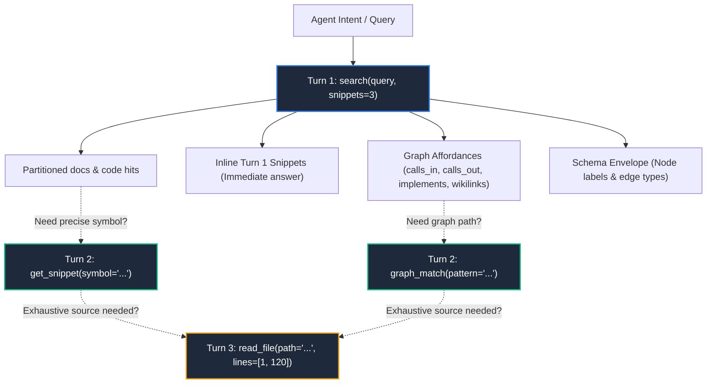
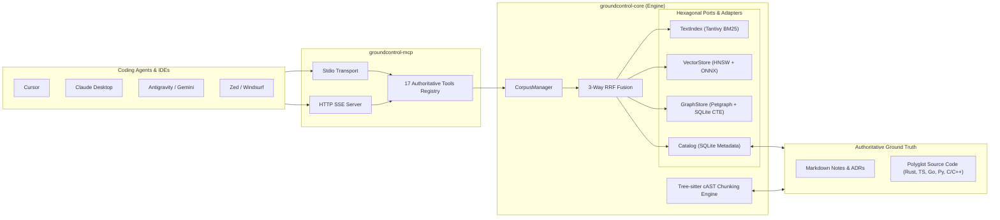

# groundcontrol (`gc`)

**The Pure Rust Model Context Protocol (MCP) Server for AI Coding Agents**

*Sub-millisecond hybrid BM25 + ONNX vector + AST knowledge graph retrieval with 3-tier progressive disclosure.*

[](https://github.com/t3e1er/groundcontrol/actions/workflows/mergebuild.yml)
[](https://github.com/t3e1er/groundcontrol/releases)
[](https://crates.io/crates/groundcontrol)
[](https://www.rust-lang.org/)
[](LICENSE)
[](crates/groundcontrol-core/src/lib.rs)
[](https://star-history.com/#t3e1er/groundcontrol&Date)

[Quickstart](#-quickstart--one-command-setup) • [Why groundcontrol?](#why-groundcontrol-the-numbers) • [Trust & Determinism](#-built-on-trust--determinism) • [Core Concepts](#-core-concepts) • [Architecture](#-architecture) • [MCP Tool Surface](#-mcp-tool-surface-17-tools) • [Docs](#-documentation-hub)


<div align="center">
  
</div>

## What is `groundcontrol`?

Modern coding agents (Cursor, Claude Desktop, Antigravity, Windsurf, Zed) suffer from **context exhaustion** and **reasoning rot**. Dumping entire directories burns millions of tokens, while naive vector RAG misses exact symbols and traditional knowledge-graph tools rely on expensive, flaky LLM extraction pipelines.

`groundcontrol` (`gc`) solves this with a **100% pure Rust** semantic Model Context Protocol server. It unifies polyglot AST code chunking, full-text Tantivy BM25, local 768-dimensional ONNX dense vectors, and typed graph traversal into a **sub-millisecond, multi-modal retrieval engine**.

Through **strict 3-Tier Progressive Disclosure**, agents get answers in a single round-trip with up to **90% token savings**.

---

## Why `groundcontrol`? The Numbers

| Metric / Dimension | `groundcontrol` (`gc`) | Naive Vector-Only RAG | Full File / Repo Dumping | LLM Graph Extraction |
|---|---|---|---|---|
| **Lexical Retrieval (p50)** | **~2.2 ms** (Tantivy BM25) | 150–400 ms | N/A | N/A |
| **Graph Traversal (p50)** | **~1.8 ms** (SQLite CTE / Petgraph) | N/A | N/A | 800–2500 ms |
| **Context Token Savings** | **85% – 90% reduction** | 40% – 60% | 0% (Context Rot) | 50% – 70% |
| **Indexing Cost** | **$0.00 (100% Local)** | High API usage | $0.00 | Very High (LLM calls) |
| **Graph Accuracy** | **100% Deterministic (AST + Links)** | N/A | N/A | Stochastic (Hallucinates) |
| **Runtime Dependencies** | **Zero C-deps, Pure Rust** | Python / C++ wheels | Plain text | Neo4j / Docker |

---

## Built on Trust & Determinism

`groundcontrol` was engineered from day one around 5 uncompromising invariants:

```
                      AUTHORITATIVE GROUND TRUTH
                 ┌──────────────────────────────────┐
                 │    Files on Disk (Markdown +     │
                 │      Polyglot Source Code)       │
                 └────────────────┬─────────────────┘
                                  │ 100% Deterministic Parsing
            ┌─────────────────────┴─────────────────────┐
            ▼                                           ▼
┌───────────────────────────┐               ┌───────────────────────────┐
│     Tree-sitter cAST      │               │   Markdown Wikilinks &    │
│ (calls, defines, imports) │               │   Schema Frontmatter      │
└───────────┬───────────────┘               └───────────┬───────────────┘
            │                                           │
            └─────────────────────┬─────────────────────┘
                                  ▼
                     DISPOSABLE DERIVED INDICES
      ┌────────────────────────────────────────────────────────┐
      │  Tantivy BM25 • HNSW Vectors • SQLite CTEs • Petgraph  │
      │         (Disposable, Rebuildable in Seconds)           │
      └────────────────────────────────────────────────────────┘
```

1. **Markdown & Source Code are Authoritative Ground Truth**: Files on disk are king. All indices (Tantivy BM25, HNSW vectors, SQLite metadata catalog, Petgraph) are derived, disposable, and 100% rebuildable. No proprietary database lock-in. Your knowledge remains human-readable, git-trackable, and portable forever.
2. **Explicit Graph Topology over Flaky Extraction**: Edges are generated deterministically from Tree-sitter AST relationships (`defines`, `imports`, `calls`, `implements`), typed frontmatter, `#tags`, and `[[wikilinks]]`. Zero non-deterministic LLM entity-extraction pipelines that hallucinate connections.
3. **Continuous Knowledge Crystallization (Principle 3)**: Ephemeral agent exhaust (debug traces, design consensus, bug resolutions) is distilled into permanent, schema-validated notes with full lineage (`derived_from` frontmatter) and ancestor tracing via Cypher-Lite `graph_match`.
4. **Pure Rust Sub-Millisecond Speed**: Written in 100% safe Rust (`unsafe_code = "forbid"`), pinned to MSRV 1.80, with zero C-runtime dependencies. Graph queries run across recursive SQLite CTEs with cycle guards in under 2ms.
5. **Multi-Agent Memory Substrate**: Built to serve as a high-concurrency shared memory layer across specialized agent swarms (Scouts, Readers, Writers, Crystallizers).

---

## Core Concepts

### 1. 3-Tier Progressive Disclosure

Rather than overwhelming the LLM with raw files or fragmented chunks, `groundcontrol` enforces a 3-tier progressive retrieval contract that preserves token budgets and eliminates hallucination:



* **Tier 1 (`search`)**: Returns high-signal handles, graph degree affordances (`calls_in: 4`, `calls_out: 12`, `wikilinks_in: 3`), and inlined source snippets for the top $K$ results. Most questions are answered in Turn 1 with zero additional tool calls.
* **Tier 2 (`get_snippet` & `graph_match`)**: Fetches bounded symbol implementations or traverses multi-hop graph paths using Cypher-Lite patterns.
* **Tier 3 (`read_file`)**: Slices bounded line ranges (`[start_line, end_line]`) only when full contextual reading is strictly required.

### 2. Bi-Modal Retrieval & 3-Way Rank Fusion (RRF)

Documentation and Polyglot Source Code are treated as distinct first-class modalities:
* **`modality="code"`**: Polyglot source code (Rust, Go, TypeScript, JavaScript, Python, Java, C/C++) chunked via Tree-sitter cAST parsing.
* **`modality="docs"`**: Markdown documentation, ADRs, RFCs, and notes chunked via heading-aware sectioning.
* **`modality="both"` (default)**: Independent 3-way Reciprocal Rank Fusion (RRF, $k=60$) combining:
  1. **Tantivy Okapi BM25**: Exact symbols, identifiers, variable names, error messages.
  2. **Dense ONNX Vector Space**: Local 768-dim `jina-embeddings-v2-base-code` for semantic concepts.
  3. **Petgraph Typed Graph Traversal**: Personalized PageRank and path connectivity.

$$\text{RRF Score}(d) = \sum_{m \in \{\text{BM25}, \text{Vector}, \text{Graph}\}} \frac{1}{60 + r_m(d)}$$

### 3. Cypher-Lite Pattern Queries (`graph_match`)

Query relationships using intuitive, linear ASCII patterns compiled directly into recursive SQLite Common Table Expressions:

```
(:CodeSymbol {name: "NewMainKubelet"})-[:calls*1..2]->(target)
(:DocNode {path: "adrs/001-architecture.md"})-[:derived_from*1..3]->(target)
(source)-[:implements]->(target)
```

Supports 5 typed edge classes:
* `code`: AST relationships (`defines`, `imports`, `calls`, `implements`).
* `semantic`: Markdown knowledge links (`wikilink`, `derived_from`, `shared_tag`).
* `structural`: Document hierarchy (`parent_child`, `section`).
* `crossmodal`: Code-to-docs links (`documents`, `implements_spec`).
* `hybrid`: Blended multi-layer graph traversals.

### 4. Polyglot Language & Capability Matrix (50+ Formats)

`groundcontrol` incorporates Tree-sitter AST parsers and syntax engines across 50+ languages, organized into three capability tiers:

| Tier | Languages | Capabilities & Graph Affordances |
|---|---|---|
| **Tier 1: Full Semantic AST & Typed Graph Extraction** | **Rust**, **TypeScript**, **JavaScript**, **Python**, **Go**, **C**, **C++**, **C#**, **Java** | Full function, class, struct, and interface extraction. Resolves call graphs (`calls`), interface implementations (`implements`), type inheritance (`extends`), annotations/decorators (`decorates`), import graphs (`imports`), normalized scope paths, and line-exact signatures. |
| **Tier 2: Structural Syntax Parsing & Symbol Indexing** | **Kotlin**, **Swift**, **PHP**, **Ruby**, **Scala**, **Zig**, **SQL**, **Dart**, **Elixir**, **Lua**, **Solidity**, **Haskell**, **OCaml**, **Bash/Shell**, **PowerShell** | AST-bounded structural chunking, top-level symbol discovery, docstring extraction, BM25 exact symbol indexing, and dense ONNX vector representations. |
| **Tier 3: Declarative Schemas, Config & Web Assets** | **Protobuf**, **YAML**, **TOML**, **JSON**, **Dockerfile**, **HTML**, **CSS**, **GraphQL**, **HCL/Terraform**, **CMake**, **Makefile**, **Markdown** | Declarative structure preservation, boundary-aware section chunking, and cross-modal document linking (`documents`, `implements_spec`). |

---

## Quickstart & One-Command Setup

### 1. Install Precompiled Standalone Binary

Install the native binary and bundled ONNX embedding sidecar for your platform:

**macOS & Linux**:
```
curl -fsSL https://raw.githubusercontent.com/t3e1er/groundcontrol/master/install.sh | sh
```

**Windows (PowerShell)**:
```
irm https://raw.githubusercontent.com/t3e1er/groundcontrol/master/install.ps1 | iex
```

**From Source (Cargo)**:
```
cargo install --locked --path crates/groundcontrol
```

### 2. Auto-Configure Your Coding Agents

`groundcontrol` features a built-in agent installer that automatically detects installed IDEs and configures their MCP configurations:

```
groundcontrol install -y
```
*Auto-detects: Cursor, Claude Desktop, Claude Code, Antigravity IDE, Gemini CLI, Windsurf, VS Code, Zed, and Kiro CLI.*

---

## Drop-in MCP Client Configurations

### Cursor (`.cursor/mcp.json`)
```json
{
  "mcpServers": {
    "groundcontrol": {
      "command": "groundcontrol",
      "args": ["--corpus", "${workspaceFolder}", "--sync"]
    }
  }
}
```

### Kiro CLI (`.kiro/settings/mcp.json`)
```json
{
  "mcpServers": {
    "groundcontrol": {
      "command": "groundcontrol",
      "args": ["--corpus", "${workspaceFolder}", "--sync"]
    }
  }
}
```

### Claude Desktop (`claude_desktop_config.json`)
```json
{
  "mcpServers": {
    "groundcontrol": {
      "command": "groundcontrol",
      "args": ["--corpus", "C:\\path\\to\\project", "--sync"]
    }
  }
}
```

### Antigravity IDE / Gemini CLI (`mcp_config.json`)
```json
{
  "mcpServers": {
    "groundcontrol": {
      "command": "groundcontrol",
      "args": ["--corpus", "${workspaceRoot}", "--sync"]
    }
  }
}
```

### Multi-Corpus / Shared HTTP Daemon
Serve multiple repositories to team swarms over HTTP SSE:
```bash
groundcontrol --mode server --bind 0.0.0.0:9090 \
  --corpus docs=/path/to/docs --corpus repo=/path/to/code \
  --default-corpus repo --profile all --sync
```

---

## MCP Tool Surface (17 Authoritative Tools)

The authoritative tool surface lives in `crates/groundcontrol-mcp/src/tools/mod.rs` (17 tools across 5 domains):

| Domain | Count | Tools | Description |
|---|---|---|---|
| **Read** | 3 | `read_file`, `get_snippet`, `list_notes` | Tier 3 polymorphic reader (`read_file` with line slices `[start_line, end_line]`), Tier 2 bounded symbol/chunk fetcher (`get_snippet`), and catalog inspector (`list_notes`). |
| **Search** | 2 | `search`, `search_related` | Tier 1 retrieval with Turn 1 hybrid snippets (`snippets: usize`, default 3) across docs & code (`mode` = `hybrid` \| `bm25` \| `semantic` \| `graph` \| `explain`), and Personalized PageRank (`search_related`). |
| **Graph** | 2 | `graph_match`, `graph_communities` | Linear Cypher-Lite ASCII path query compiled to recursive SQLite CTEs (`graph_match`), and Leiden/Louvain community detection (`graph_communities`). |
| **Write** | 3 | `write_note`, `delete_note`, `move_note` | Schema-driven authoring (`write_note` with `mode="create"|"overwrite"|"append"|"prepend"`), note removal (`delete_note`), and wikilink refactoring (`move_note`). |
| **Validation** | 2 | `validate`, `list_templates` | Unified template and taxonomy validator (`validate` with `check_taxonomy=true`), and template discovery (`list_templates`). |
| **System** | 5 | `status`, `list_corpora`, `sync_corpus`, `index_corpus`, `unload_corpus` | Multi-corpus overview (`status` with `scope="corpus"|"indexing"|"graph"|"coverage"|"all"`), corpus listing, delta/full reindexing, and dynamic runtime management. |

### Role-Based Tool Profiles (`--profile`)
Gate tool exposure to prevent agent distraction:
* **`--profile scout`** (6 tools): Minimal read-only retrieval set (`search`, `search_related`, `get_snippet`, `read_file`, `list_notes`, `status`).
* **`--profile analysis`** (11 tools): `scout` + read-only graph (`graph_match`, `graph_communities`), validation (`validate`, `list_templates`), and `list_corpora`.
* **`--profile all`** (17 tools, default): Full suite including mutating writes (`write_note`, `delete_note`, `move_note`, `sync_corpus`, `index_corpus`, `unload_corpus`).

---

## Architecture



### Workspace Crates
* [`crates/groundcontrol-common`](crates/groundcontrol-common): Domain types, ports traits, TOML configuration, error types.
* [`crates/groundcontrol-core`](crates/groundcontrol-core): Engine orchestration, Tantivy BM25, ONNX embedder (`ort` / DirectML), Petgraph, SQLite metadata, Tree-sitter cAST parser.
* [`crates/groundcontrol-mcp`](crates/groundcontrol-mcp): Model Context Protocol server (stdio & HTTP SSE), 17-tool registry, tool profiles.
* [`crates/groundcontrol-cli`](crates/groundcontrol-cli): Composition root binary, multi-corpus manager, agent auto-installer.
* [`examples`](examples): Steering rules ([Cursor](examples/steering/cursorrules.md), [Claude](examples/steering/claude-system-prompt.md), [Antigravity](examples/steering/groundcontrol-rules.md)), [skills](examples/skills/), and [starter-vault](examples/starter-vault/).

---

## Documentation Hub

The complete documentation is structured into three authoritative pillars as a self-indexing knowledge corpus following Principle 3:

* **[Architecture & Systems Engineering](docs/architecture/index.md)**: Building and deployment guides, trust and ground-truth invariants, hexagonal implementation internals, and the complete catalog of 17 Architectural Decision Records (ADRs).
* **[Concepts & Retrieval Theory](docs/concepts/index.md)**: 3-tier progressive disclosure token contracts, Turn 1 graph affordances, 4-modality hybrid search, and Reciprocal Rank Fusion (RRF) mathematics.
* **[Roadmap & RFC Archive](docs/roadmap/index.md)**: Engineering codebase roadmap and implemented technical RFC specifications.

## Contributing & Community

We love contributions that honor our core principles:
* Check our [Contributing Guide](CONTRIBUTING.md) and [Pull Request Template](.github/PULL_REQUEST_TEMPLATE.md).
* Discuss ideas in [GitHub Discussions](https://github.com/t3e1er/groundcontrol/discussions).
* Report issues via our structured [Issue Templates](.github/ISSUE_TEMPLATE/).

---

## License

MIT © [Trent Meier](https://github.com/t3e1er)
