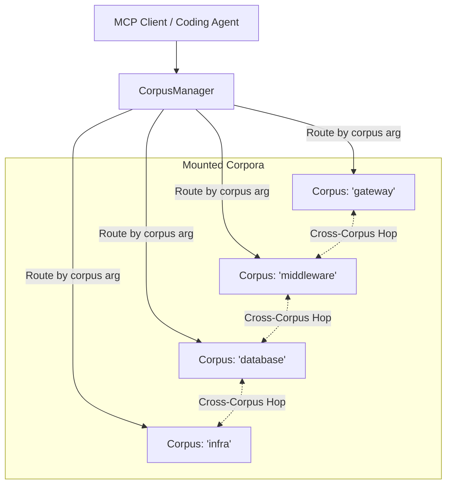

# Cross-Corpus Federation & Multi-Repo Serving

Enterprise applications rarely live in a single repository. Microservices, shared libraries, and infrastructure configurations span multiple distinct codebases.

`groundcontrol` features **Cross-Corpus Federation**, allowing a single server instance to mount, query, and traverse across $N$ independent index roots.

* **CorpusManager Engine**: [`crates/groundcontrol-core/src/corpus_manager.rs`](file:///c:/dev/ctx/groundcontrol/crates/groundcontrol-core/src/corpus_manager.rs)
* **Federated Traversal Algorithm**: [`crates/groundcontrol-core/src/corpus_manager.rs#L400-L550`](file:///c:/dev/ctx/groundcontrol/crates/groundcontrol-core/src/corpus_manager.rs)

---

## 1. The `CorpusManager` Architecture

The `CorpusManager` maintains a concurrent registry of isolated `Engine` instances, each managing its own SQLite catalog, Tantivy index, and Petgraph graph.

---

## 2. Multi-Corpus Scoping

Every MCP read and search tool accepts an optional `corpus` or fan-out `corpora` parameter:
* `corpus="gateway"`: Scopes the query to a single repository.
* `corpora=["gateway", "middleware"]`: Searches across specified repositories in parallel, applying Reciprocal Rank Fusion across the combined candidate sets.
* `corpora="all"`: Broadcasts the query across all mounted corpora.

---

## 3. Federated Graph Traversal

When code in `gateway` calls an API endpoint defined in `middleware`, `groundcontrol` resolves the boundary reference via external symbol resolution:
* Links cross from `gateway::Client::call` to `middleware::Router::handle`.
* The traversal carries `CorpusHop` provenance records, detailing:
  * `from_corpus` & `from_node`
  * `to_corpus` & `to_node`
  * `edge_type` and `confidence`
* Traversal depth is bounded deterministically to prevent runaway loops across circular repository dependencies.

---

## 4. Central Storage & SCM Bootstrapping

To keep code repositories clean, index artifacts default to central storage:
* **Default Central Index Location**: `${GROUNDCONTROL_CACHE_DIR}/corpora/<name>/` (`meta.db`, `tantivy/`, `vectors.bin`, `graph.bin`).
* **Source Path Tracking**: The originating repository path and active `CorpusConfig` are stored in SQLite `meta.db` under the `corpus_config` key.
* **SCM Commit Bundles**: Repositories can commit an index artifact at `.groundcontrol/vault.tar.zst` (`groundcontrol export-artifact`). When a new repository is mounted or indexed, [`CorpusManager::ensure_corpus`](file:///c:/dev/ctx/groundcontrol/crates/groundcontrol-core/src/corpus_manager.rs) checks for this bundle and auto-imports it if the central index is empty.
* **Server Boot & Zero Fallback**: On boot without `--corpus` arguments, [`CorpusManager::mount_all_cached_corpora`](file:///c:/dev/ctx/groundcontrol/crates/groundcontrol-core/src/corpus_manager.rs) mounts all known cached corpora. If no cached corpora exist, it starts cleanly with 0 corpora.

---

## 5. Dynamic Mounting & Continuous Watchers

When running with `--watch`:
* Active corpora are monitored for filesystem events (markdown and source files).
* The MCP server registers a callback via [`CorpusManager::set_on_corpus_mounted`](file:///c:/dev/ctx/groundcontrol/crates/groundcontrol-core/src/corpus_manager.rs).
* Whenever a client invokes `index_corpus` dynamically, a dedicated [`spawn_corpus_watcher`](file:///c:/dev/ctx/groundcontrol/crates/groundcontrol-core/src/watcher.rs) is automatically spawned, keeping the index synchronized in real time.
