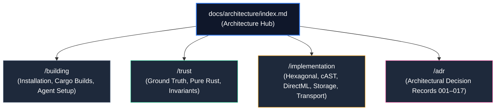

# Architecture & Systems Engineering Hub

Welcome to the **Architecture & Systems Engineering** section of `groundcontrol` (`gc`). This hub covers system-level design, hardware governors, systems safety, build operations, and formal architectural decisions.

---

## Architectural Clusters

### 1. 🏗️ [[docs/architecture/building/index]] (Building & Deployment)
* **Installation**: Native precompiled binaries and sidecar models via [[docs/architecture/building/installation]].
* **Building from Source**: Cargo compilation, DirectML, and fast mode via [[docs/architecture/building/build-from-source]].
* **Client Configurations**: Automated setup for Cursor, Claude Desktop, Antigravity, Windsurf, and Zed via [[docs/architecture/building/client-setup]].
* **Daemons & Servers**: Auto-daemons and multi-corpus HTTP SSE servers via [[docs/architecture/building/daemon-and-server]].

### 2. 🛡️ [[docs/architecture/trust/index]] (Trust, Safety & Determinism)
* **Authoritative Ground Truth**: Files on disk are king; disposable indices via [[docs/architecture/trust/files-are-ground-truth]].
* **Deterministic Graphs**: Compiler AST grammars vs stochastic LLMs via [[docs/architecture/trust/deterministic-graph]].
* **Pure Rust Invariants**: `#![forbid(unsafe_code)]`, zero C-deps, and sub-2ms latency via [[docs/architecture/trust/pure-rust-invariants]].
* **Schema Validation**: Templates and taxonomy enforcement via [[docs/architecture/trust/schema-validation]].
* **Knowledge Crystallization**: Distilling agent exhaust into permanent notes via [[docs/architecture/trust/knowledge-crystallization]].

### 3. ⚙️ [[docs/architecture/implementation/index]] (Implementation & Internals)
* **Hexagonal Architecture**: Isolating backends behind domain port traits via [[docs/architecture/implementation/hexagonal-architecture]].
* **cAST Polyglot Chunking**: Tree-sitter AST parsing across 16+ languages via [[docs/architecture/implementation/cast-chunking]].
* **DirectML GPU Governor**: DirectX 12 compute, AIMD 70% VRAM ceiling, and TDR safety via [[docs/architecture/implementation/gpu-and-directml]].
* **Zero-Copy Storage**: Aligned binary vectors and disk file offset mappings via [[docs/architecture/implementation/zero-copy-storage]].
* **Cross-Corpus Federation**: Multi-corpus routing and federated BFS traversal via [[docs/architecture/implementation/cross-corpus-federation]].
* **MCP Transports**: Stdio framing, HTTP SSE transport, and 17-tool registry via [[docs/architecture/implementation/mcp-transport]].

### 4. 📜 [[docs/architecture/adr/index]] (Architectural Decisions)
* Complete catalog of **17 Architectural Decision Records** (ADR 001 through ADR 017) detailing ranking models, graph clustering, token contracts, and systems isolation.
