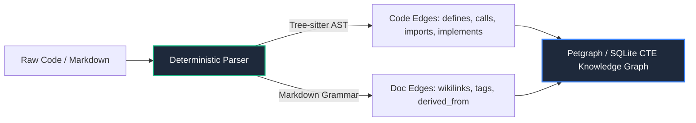

---
title: "Deterministic Graphs vs LLM Extraction"
description: "Why AST grammar parsers and typed link extractors eliminate stochastic hallucination in knowledge graphs."
category: "trust"
status: "active"
tags: ["ast", "tree-sitter", "knowledge-graph", "determinism", "hallucination"]
related:
  - "[[docs/architecture/trust/index]]"
  - "[[docs/concepts/search/graph-traversal]]"
  - "[[docs/architecture/implementation/cast-chunking]]"
  - "[[docs/architecture/adr/adr-005-deterministic-vs-llm-graph-extraction]]"
---

# Deterministic Graphs vs LLM Extraction

Many "Graph RAG" systems rely on passing text chunks to large language models (LLMs) with prompts like *"Extract all entities and relationships as triples."*

While attractive in academic prototypes, this pattern is fundamentally flawed for production software engineering.

---

## Failure Modes of LLM Graph Extraction

1. **Non-Deterministic Edge Generation**: The same codebase indexed twice yields different graph nodes, inconsistent relationship names (`calls` vs `invokes` vs `triggers`), and missing edges due to sampling temperature.
2. **Hallucinated Edges**: LLMs regularly hallucinate dependencies between functions that do not exist, causing agents to propose broken refactorings.
3. **Extreme Indexing Cost & Latency**: Running entity extraction across a 100,000-line codebase requires thousands of LLM API calls, costing significant money and taking hours to complete.
4. **No Compiler Grounding**: An LLM cannot reliably distinguish between a local variable, a class method, a type definition, or an imported external crate symbol without full compiler syntax analysis.

---

## The Deterministic Grammar Invariant

`groundcontrol` eliminates LLM entity extraction entirely in favor of **100% deterministic Tree-sitter cAST parsing and link grammars**:

### 1. Code Modality: Tree-sitter cAST
* **Language Grammars**: Parsed using official Tree-sitter grammars (Rust, Go, TypeScript, Python, C++, Java, etc.).
* **Exact Edge Types**:
  * `defines`: Structs, functions, enums, interfaces, classes.
  * `imports`: Qualified module and file dependencies.
  * `calls`: Function invocations bounded by scope.
  * `implements`: Trait and interface implementations.
* **Reproducibility**: Run the indexer 1,000 times, and the resulting graph topology is identical down to the byte.

### 2. Documentation Modality: Typed Markdown
* **`[[wikilinks]]`**: Explicit conceptual connections between notes.
* **`#tags`**: Semantic clustering taxonomies.
* **Frontmatter Schemas**: Strict fields (`category`, `related`, `derived_from`, `supersedes`).

### Performance Result
* **Speed**: Indexes thousands of symbols per second in pure native Rust.
* **Cost**: $0.00 in LLM API fees.
* **Confidence**: 100% compiler-backed fidelity.
