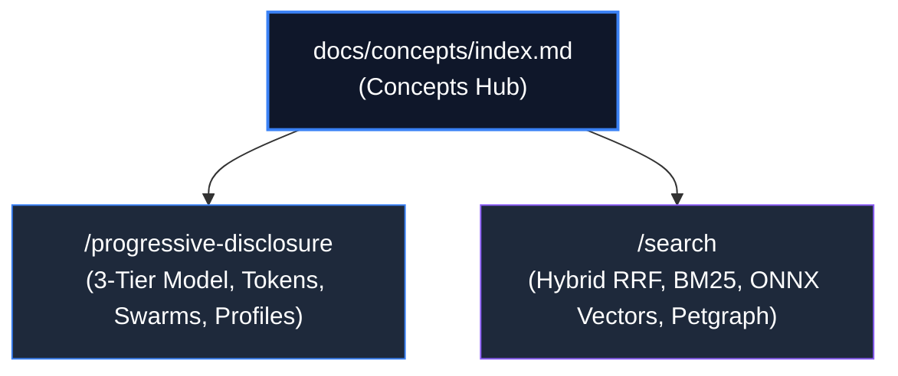

# Concepts & Retrieval Theory Hub

Welcome to the **Concepts & Retrieval Theory** section of `groundcontrol` (`gc`). This hub covers mathematical foundations, multi-modal hybrid ranking, token economics, and agentic interaction models.

---

## Conceptual Pillars

### 1. ⚡ [[docs/concepts/progressive-disclosure/index]] (Progressive Disclosure & Agentic Strategy)
* **The 3-Tier Model**: The strict contractual progression (Tier 1 search $\to$ Tier 2 symbol $\to$ Tier 3 lines) via [[docs/concepts/progressive-disclosure/three-tier-model]].
* **Turn 1 Affordances**: Inlined snippets, graph degree counts (`calls_in`, `calls_out`), and schema envelopes via [[docs/concepts/progressive-disclosure/turn-1-affordances]].
* **Agentic Memory Economics**: Preserving token budgets across long-running tasks (85–90% savings) via [[docs/concepts/progressive-disclosure/agentic-memory]].
* **Swarm Topologies**: Orchestrating specialized Scout, Reader, Writer, and Crystallizer agents via [[docs/concepts/progressive-disclosure/swarm-topologies]].
* **Tool Profiles**: Gating the 17 authoritative MCP tools via `--profile scout|analysis|all` via [[docs/concepts/progressive-disclosure/tool-profiles]].

### 2. 🔍 [[docs/concepts/search/index]] (Search & Multimodal Retrieval)
* **Hybrid Theory**: Overcoming failure modes of vector-only and keyword-only search via [[docs/concepts/search/hybrid-retrieval-theory]].
* **RRF Mathematics**: Formal proofs and smoothing parameter $k=60$ selection via [[docs/concepts/search/rrf-mathematics]].
* **BM25 Lexical**: Tantivy Okapi BM25 for exact symbols, identifiers, and compiler errors via [[docs/concepts/search/bm25-lexical]].
* **Dense Vectors**: 768-dimensional Jina Code v2 ONNX embeddings and HNSW graphs via [[docs/concepts/search/embeddings-vector]].
* **Graph Traversal**: Sub-millisecond Cypher-Lite recursive SQLite CTEs and Leiden modularity via [[docs/concepts/search/graph-traversal]].
* **Modal Parameters**: Controlling `mode="hybrid"|"bm25"|"semantic"|"graph"|"explain"` via [[docs/concepts/search/search-modes-modalities]].
