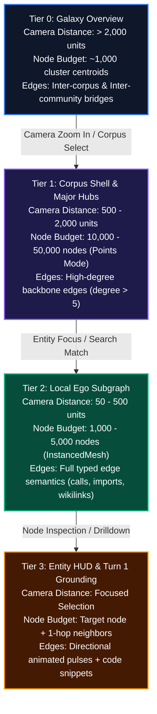

# Visual Progressive Disclosure & Tiered 3D Graph LOD

In `groundcontrol`, **Progressive Disclosure** is the foundational doctrine that protects cognitive and computational bandwidth: agents and humans should never be forced to ingest an exhaustive firehose when bounded, high-signal abstractions are sufficient.

While the [[docs/concepts/progressive-disclosure/three-tier-model]] applies progressive disclosure to LLM context windows (Tier 1 Handles $\to$ Tier 2 Symbols $\to$ Tier 3 Line Slices), **GraphView** extends this exact paradigm into the visual domain for multi-million node knowledge graphs.

---

## 1. The $1\text{M}+$ Node Visual Paradox

Attempting to draw $1\text{M}$ 3D meshes and $3\text{M}$ edge lines simultaneously in a browser fails across three physical bottlenecks:

```
1. DOM / Scene Graph Overload: 1,000,000 THREE.Mesh objects = ~8 GB V8 heap -> Instant Browser Crash.
2. GPU Draw Call / Geometry Memory: 1,000,000 spheres (InstancedMesh) = 64 MB matrix buffer + vertex shader overhead.
3. Edge Rendering Fill Rate: 3,000,000 lines = 6,000,000 vertices (144 MB LineSegments) -> 5 FPS bottleneck on even discrete GPUs.
```

To achieve silky 60 FPS performance at $1\text{M}+$ nodes without sacrificing architectural insight, `groundcontrol-graphview` introduces a **4-Tier Level-of-Detail (LOD)** visual engine.

---

## 2. The 4-Tier Visual LOD Hierarchy



### Tier 0: Galaxy Overview ($N \approx 1\text{K}$)
- **Rendering Mechanism**: High-order community and multi-corpus centroids calculated via Louvain/Leiden clustering in petgraph.
- **Visual Encoding**: Glowing nebulas and corpus clusters with galaxy-scale spatial separation.
- **Edge Strategy**: Aggregate bundle tubes representing cross-corpus and inter-module coupling weight.

### Tier 1: Corpus Shell & Hubs ($N = 10\text{K} - 50\text{K}$)
- **Rendering Mechanism**: `THREE.Points` with a custom GLSL particle shader.
- **Memory Footprint**: Flat `Float32Array` attributes (`position`, `color`, `size`). Only $1.2\text{ MB}$ total VRAM.
- **Edge Strategy**: Filtered edge budget capped at $50\text{K}$ visible lines. Only edges touching high-degree hubs ($k > 5$) or matched search queries are uploaded to the GPU.

### Tier 2: Local Ego Subgraph ($N \le 5\text{K}$)
- **Rendering Mechanism**: `THREE.InstancedMesh` with metallic PBR shading and bloom emissives.
- **Visual Encoding**: Full geometry representation. Node radii scaled proportionally to graph degree:
  $$R_i = R_{\text{base}} \cdot \log_2(1 + \text{deg}(i))$$
- **Edge Strategy**: Fully realized typed edges color-coded by relation type (`calls`, `defines`, `imports`, `implements`, `wikilinks`).

### Tier 3: Entity HUD & Grounding ($N = 1 + \text{Neighbors}$)
- **Rendering Mechanism**: HTML5 HUD overlay with Turn 1 progressive context.
- **Context Surfacing**: Symbol signature, source file path, AST breadcrumbs, doc snippet, and graph affordance degree counts (`calls_in`, `calls_out`, `implements`).

---

## 3. WebGL Rendering Mechanics: Points vs InstancedMesh

To guarantee responsiveness across devices, the rendering pipeline dynamically swaps underlying Three.js primitives based on active node count:

| Parameter | `THREE.Points` Mode | `THREE.InstancedMesh` Mode |
|---|---|---|
| **Active Node Threshold** | $> 25,000$ nodes | $\le 25,000$ nodes |
| **Vertices per Node** | $1$ vertex | $42$ vertices (Icosahedron) |
| **Draw Calls** | $1$ draw call | $1$ draw call |
| **VRAM at $100\text{K}$ Nodes** | $3.2\text{ MB}$ | $67.2\text{ MB}$ |
| **Custom Shader** | Custom Point Sprite with soft radial falloff | Standard MeshPhysicalMaterial with bloom pass |
| **Raycasting Picking** | BVH Octree spatial query in Web Worker | `THREE.Raycaster` against instance matrices |

---

## 4. Chromatic Signal Architecture & Neon Aesthetics

GraphView avoids drab generic colors in favor of a curated, high-contrast dark palette designed for instant visual comprehension:

### Entity Color Encoding

| Entity Category | Hex Code | Visual Style | Semantics |
|---|---|---|---|
| **Documentation Note** | `#3b82f6` (Sapphire Blue) | Diffuse Glow | Markdown knowledge notes, ADRs, concept specs |
| **Code Function / Method** | `#10b981` (Emerald Green) | Bright Neon | Executable logic, AST function definitions |
| **Struct / Class / Type** | `#8b5cf6` (Electric Purple) | Core Radiant | Data types, schemas, interfaces, traits |
| **Module / File** | `#06b6d4` (Cyan) | Soft Halos | Source code files and module namespaces |
| **Query Match** | `#f59e0b` (Amber Flare) | 2.5x Size + Pulse | Nodes satisfying active search or Cypher query |
| **Agent Active Pulse** | `#ec4899` (Hot Magenta) | Expanding Ripple | Real-time agent activation via SSE stream |

### UnrealBloom Aesthetic Pass
A post-processing pipeline featuring `UnrealBloomPass` (threshold: `0.15`, strength: `1.8`, radius: `0.75`) creates a vibrant "sci-fi command bridge" aesthetic where highly active or queried nodes cast organic neon light across nearby graph constellations.

---

## 5. Multi-Agent Temporal Activations

When multiple AI agents collaborate over MCP, GraphView visualizes their collective activity in real time.

Rather than static highlights, activations are modeled as **exponentially decaying energy waves**:
$$E_i(t) = E_{\text{peak}} \cdot e^{-\lambda (t - t_0)}$$

Where:
- $t_0$ is the activation timestamp received via SSE.
- $\lambda$ is a user-configurable decay constant (controlled via the "Activation Persistence" UI slider, $0.5\text{s} - 10\text{s}$).
- In shader space, $E_i(t)$ modulates point size and bloom intensity, enabling the operator to visually distinguish hot execution paths from idle memory corridors.
