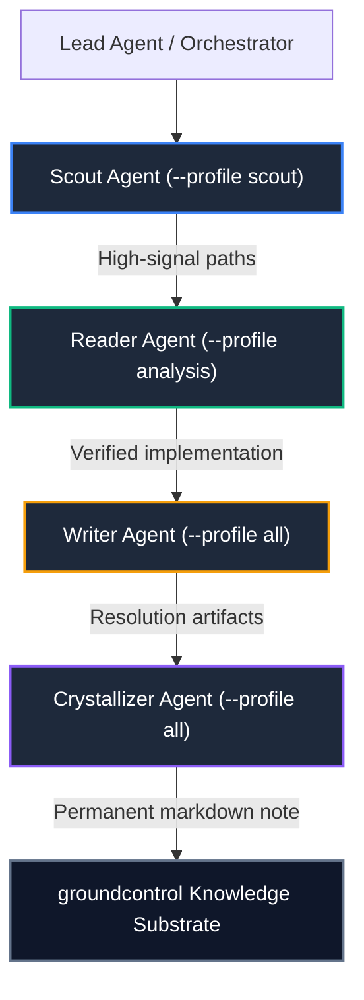

---
title: "Multi-Agent Swarm Topologies"
description: "Coordinating specialized Scout, Reader, Writer, and Crystallizer agents over a shared groundcontrol substrate."
category: "progressive-disclosure"
status: "active"
tags: ["swarms", "scout", "reader", "writer", "crystallizer", "orchestration"]
related:
  - "[[docs/concepts/progressive-disclosure/index]]"
  - "[[docs/concepts/progressive-disclosure/tool-profiles]]"
  - "[[docs/architecture/trust/knowledge-crystallization]]"
---

# Multi-Agent Swarm Topologies

When executing complex tasks, deploying a single omnipotent agent leads to confusion and conflicting tool calls.

`groundcontrol` is designed to power **specialized multi-agent swarms**, where each agent operates with a bounded role, gated tool surface, and specific cognitive contract.

---

## The 4 Core Agent Roles

### 1. The Scout Agent (`--profile scout`)
* **Objective**: Rapid landscape discovery and information scent tracking.
* **Tools**: `search`, `get_snippet`, `status`.
* **Output**: A compact list of relevant file paths, symbols, and graph degree hints. Zero edits.

### 2. The Reader Agent (`--profile analysis`)
* **Objective**: Deep structural comprehension and dependency tracing.
* **Tools**: `get_snippet`, `read_file`, `graph_match`, `graph_communities`.
* **Output**: Exhaustive analysis of functions, call chains, and architectural constraints.

### 3. The Writer Agent (`--profile all`)
* **Objective**: Executing code refactorings, adding unit tests, and editing files.
* **Tools**: Standard IDE file edits + `validate` to confirm integrity.

### 4. The Crystallizer Agent (`--profile all`)
* **Objective**: Synthesizing the final bug resolution, architectural decision, or debugging trace into a permanent note.
* **Tools**: `list_templates`, `write_note`, `validate`.
* **Output**: A new markdown note with `derived_from` lineage, verified against the corpus template.
