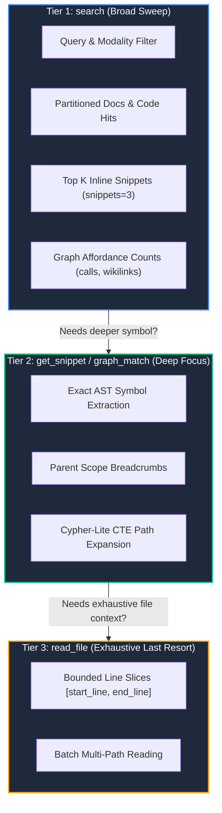

# The 3-Tier Progressive Disclosure Model

`groundcontrol` enforces a strict 3-tier retrieval progression to protect the agent's context window while guaranteeing complete answers.



---

## Tier 1: `search` (Broad Sweep & Instant Answers)

* **Tool**: `search(query, mode="hybrid", snippets=3)`
* **Code Implementation**: [`crates/groundcontrol-mcp/src/tools/mod.rs`](file:///c:/dev/ctx/groundcontrol/crates/groundcontrol-mcp/src/tools/mod.rs)
* **Token Budget**: 300 – 800 tokens total.
* **Payload**:
  * Partitioned `docs` and `code` hits.
  * Direct inline source snippets for the top $K$ hits (default 3), answering most questions in Turn 1 with zero follow-up calls.
  * Graph affordance counters (`calls_in`, `calls_out`, `implements`, `imports`, `wikilinks_in`).
  * Active schema envelope (valid node labels and edge types).

---

## Tier 2: `get_snippet` & `graph_match` (Targeted Inspection)

* **Tool**: `get_snippet(symbol="...")` or `graph_match(pattern="...")`
* **Code Implementation**: [`crates/groundcontrol-mcp/src/tools/mod.rs`](file:///c:/dev/ctx/groundcontrol/crates/groundcontrol-mcp/src/tools/mod.rs), backed by [`crates/groundcontrol-core/src/catalog/sqlite.rs`](file:///c:/dev/ctx/groundcontrol/crates/groundcontrol-core/src/catalog/sqlite.rs)
* **Token Budget**: 150 – 500 tokens per call.
* **Payload**:
  * Exact bounded AST function or struct definition with scope breadcrumbs (e.g. `impl Engine > fn search`).
  * Multi-hop relationship paths connecting symbols or documents.
* **Rule**: Agents only call Tier 2 when Turn 1 snippets signal that deeper structural understanding is needed.

---

## Tier 3: `read_file` (Exhaustive Reading)

* **Tool**: `read_file(path="...", start_line=1, end_line=100)`
* **Code Implementation**: [`crates/groundcontrol-mcp/src/tools/mod.rs`](file:///c:/dev/ctx/groundcontrol/crates/groundcontrol-mcp/src/tools/mod.rs)
* **Rule**: Full file reads without line boundaries are treated as an emergency fallback. Agents are instructed to read targeted slices.

---

## The Lean Multiline Text Emission Protocol (ADR-020)

To maximize prompt reasoning context and eliminate syntactic JSON tax across the 3 tiers, `groundcontrol` standardizes on **Lean Multiline Text Emission** (governed by [ADR-020](file:///c:/dev/ctx/groundcontrol/docs/architecture/adr/adr-020-lean-multiline-text-emission.md) and [RFC-lean-multiline-text-emission](file:///c:/dev/ctx/groundcontrol/docs/roadmap/RFC-lean-multiline-text-emission.md)):

```mermaid
flowchart LR
    T1["Turn 1: search<br/>(Markdown List + Scores + Snippets)"] -->|-> [T2a fetch]| T2a["Turn 2a: get_snippet<br/>(L<num>: Bounded Code + Docstring)"]
    T1 -->|-> [T2b graph]| T2b["Turn 2b: graph_match<br/>(2-Space ASCII Cypher Tree)"]
    T2a -->|-> [T3 full file]| T3["Turn 3: read_file<br/>(Line-Numbered Markdown Block)"]
```

### Formatting Contracts by Turn

| Turn | Tool | Output Format | Token Savings | Scents & Navigation Hints |
|---|---|---|---|---|
| **Turn 1** | `search` | Markdown list partitioned by `## Code Hits` and `## Doc Hits`. Non-zero score components only (`bm25`, `vec`, `graph`). Top $K$ hits inline syntax-highlighted code. | **50%–60%** vs JSON array | `-> [T2a fetch] get_snippet(name: "...")`<br/>`-> [T2b graph] graph_match("...")` |
| **Turn 2a** | `get_snippet` | Single symbol header `# Symbol: Name (path:Lstart-Lend)`. Prefixed line numbers (`L<num>: `). Docstrings in blockquotes. Grammar-driven `incoming` & `outgoing` handles. | **40%–50%** vs JSON object | `-> [T2b callers] graph_match("...")`<br/>`-> [T3 full file] read_file("...")` |
| **Turn 2b** | `graph_match` | Indented ASCII Cypher tree with summary header (`[direct: D, transitive: T, files: F, depth: H]`). Hub suppression (`... (+N more)`). Cycle markers (`[CYCLE: -> target]`). | **65%–70%** vs nested JSON | Direct jump handles `-> [T2a fetch] get_snippet(symbol: "...")` |
| **Turn 3** | `read_file` | `# File: \`path\` [lines: L<start>-L<end> of <total>, language: <lang>]` followed by line-numbered (`L<num>: `) fenced code blocks for single files or batch arrays. | **15%–25%** (eliminates JSON `\n` and `\"` escaping) | Fully authoritative context for line-exact editing. |

> [!NOTE]
> MCP clients invoking `groundcontrol` automatically receive lean multiline text over stdio transport. Automated test suites or programmatic tools requiring machine-parsed JSON payloads can explicitly pass `"format": "json"`.

