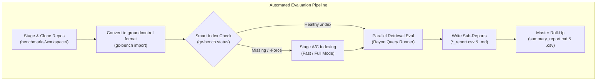

# Retrieval & Indexing Data Science Benchmark Harness

Benchmarking and Information Retrieval (IR) evaluation in the `groundcontrol` ecosystem follow a **Two-Tier Architecture**:

1. **`groundcontrol-algo` (Crate & `gc-algo` CLI)**:
   - Standalone per-algorithm retrieval library and CLI located in [`crates/groundcontrol-algo`](file:///c:/dev/semantic/groundcontrol/crates/groundcontrol-algo).
   - Exposes every retrieval algorithm (`binary`, `bm25`, `ppr`, `fast`, `semantic`, `hybrid`) as an independently callable library function without MCP or subprocess overhead.
   - Provides runtime variant ablation knobs (`FlatSif` vs `PartitionedHyperplane`).

2. **`groundtruth` (`gt` Evaluation Harness)**:
   - Decoupled academic evaluation suite located in [`groundtruth`](file:///c:/dev/semantic/groundtruth).
   - Evaluates algorithm variants in serial (`gt ablate`) via direct Cargo path dependency on `groundcontrol-algo` (`AlgoBackend`).
   - Evaluates system-level multi-agent workflows (`gt run`) via stdio JSON-RPC against the production MCP server (`McpBackend`).

---

## 1. Architectural Principles & Isolation

1. **Zero Production Bloat**: All benchmark datasets, query catalogs (CodeSearchNet, RepoBench, SWE-bench, OpenTelemetry demo), ground-truth qrels, and statistical significance tests live in `groundtruth`. Production `groundcontrol` binaries remain completely free of evaluation artifacts.
2. **Direct In-Process Access for Micro-Ablation**: Rather than paying MCP JSON-RPC transport overhead (~80ms) when benchmarking algorithmic differences, `groundtruth`'s `AlgoBackend` makes direct Rust function calls into `groundcontrol-algo` (~0µs overhead), ensuring jitter-free latency distributions.
3. **Decoupled System Testing**: Multi-agent retrieval, tool dispatch, and Turn 1-3 progressive disclosure contracts are evaluated through the universal MCP interface.


---

## 2. Indexing Resource Profiler

The indexing profiler ([`IndexProfiler`](file:///c:/dev/ctx/groundcontrol/crates/groundcontrol-bench/src/profile/index_profiler.rs)) executes a clean or incremental build and records:
- **Wall-Clock Stage Timings**:
  - Total elapsed indexing time.
  - Reindex stage (AST tree-sitter parsing, Tantivy BM25 postings, static SIF projections, binary fingerprints, and Petgraph AST edges).
  - Commit & checkpoint stage (SQLite flush, Tantivy commit, binary persistence).
  - Optional dense neural ONNX re-embedding stage.
- **Throughput**: Documents / files per second.
- **Memory Footprint**: Process resident set size (RSS), peak RSS, and memory delta via [`MemoryTracker`](file:///c:/dev/ctx/groundcontrol/crates/groundcontrol-bench/src/profile/memory.rs).
- **Disk Storage Breakdown & Expansion**: Measures `.index/` files (`meta.db`, `tantivy/`, `fingerprints.bin`, `graph.bin`, `vectors.bin`, `projections/`) against source bytes and computes the expansion ratio via [`DiskProfiler`](file:///c:/dev/ctx/groundcontrol/crates/groundcontrol-bench/src/profile/disk.rs).

---

## 3. Retrieval Algorithm Quality & Latency Ablation

Evaluates each individual algorithm against a ground-truth QRELS dataset ([`DatasetLoader`](file:///c:/dev/ctx/groundcontrol/crates/groundcontrol-bench/src/dataset/loader.rs)):

| Retrieval Mode | Underlying Port / Mechanism |
|---|---|
| `bm25` | Tantivy Okapi BM25 lexical inverted index with injected syntactic pattern tokens. |
| `binary` | Static SIF projection + 256-bit MRL binary Hamming scan via single-cycle AVX-512 / AVX2 POPCOUNT. |
| `ppr` | Isolated HippoRAG 2-hop personalized PageRank diffusion across Petgraph code and doc topology. |
| `fast` | 3-Way Reciprocal Rank Fusion fusing BM25, Binary Hamming, and PPR diffusion without neural ONNX models. |
| `semantic` | Dense vector cosine similarity via ONNX embeddings (`jina-embeddings-v2-base-code`). |
| `full` | 3-Signal hybrid search fusing BM25, dense ONNX vectors, and BFS graph proximity. |

### Measured Information Retrieval & Latency Metrics
- **Recall@K**: Proportion of ground-truth relevant documents retrieved in the top $K$.
- **Precision@K**: Fraction of top $K$ retrieved results that are relevant.
- **MRR@K**: Mean Reciprocal Rank ($1 / \text{rank}$ of the first relevant hit).
- **NDCG@K**: Normalized Discounted Cumulative Gain with support for graded relevance ($0$ to $3$).
- **Score Separation**: Confidence ratio ($\text{Score}_{\text{top-1}} / \text{Score}_{\text{top-K}}$).
- **Latency Percentiles**: Measured high-resolution timings (p50, p90, p95, p99, mean, min, max) and sustained throughput (QPS) via [`LatencyTracker`](file:///c:/dev/ctx/groundcontrol/crates/groundcontrol-bench/src/metrics/latency.rs).

---

## 4. CLI Usage Guide (`gc-bench`)

### 1. Profile Indexing Only
```bash
cargo run -p groundcontrol-bench -- index \
  --corpus /path/to/corpus \
  --clean \
  --output ./benchmarks/index_profile.json
```

### 2. Run Retrieval Evaluation Only
```bash
cargo run -p groundcontrol-bench -- eval \
  --corpus /path/to/corpus \
  --queries ./benchmarks/queries.json \
  --modes bm25,binary,ppr,fast,full \
  --k 10 \
  --output-dir ./benchmarks/output \
  --output-prefix my_repo
```

### 3. Check Corpus Index Health & Status
```bash
cargo run -p groundcontrol-bench -- status --corpus /path/to/corpus
```

### 4. Aggregate Multi-Repo Sub-Reports into Master Leaderboard
```bash
cargo run -p groundcontrol-bench -- aggregate \
  --results-dir ./benchmarks/results \
  --output-dir ./benchmarks/results
```

---

## 5. Automated Multi-Repo & Multi-Dataset Pipeline

The benchmark pipeline ([`benchmarks/run-benchmark-pipeline.ps1`](file:///c:/dev/ctx/groundcontrol/benchmarks/run-benchmark-pipeline.ps1) and [`benchmarks/run-benchmark-pipeline.sh`](file:///c:/dev/ctx/groundcontrol/benchmarks/run-benchmark-pipeline.sh)) automates end-to-end evaluation across external reference benchmarks (**SWE-bench Lite**, **CodeSearchNet**, **RepoBench-R**):



### Methodology & Execution Discipline
1. **Workspace & Staging Isolation**:
   - Cloned reference repositories and downloaded raw datasets live under `benchmarks/workspace/` (`.gitignore` excluded to preserve a lean repository).
   - Results, publication artifacts, and profiles are committed to `benchmarks/results/`.
2. **Deterministic Seeded Sampling**:
   - Supports fast ablation runs via `-FastSample -SamplePerRepo 10 -Seed 42` ([`DeterministicSampler`](file:///c:/dev/ctx/groundcontrol/crates/groundcontrol-bench/src/dataset/sampler.rs)).
3. **Smart Index Reuse**:
   - Inspects `.index/meta.db` document counts via `gc-bench status`. Re-indexing is skipped if an index already exists and is healthy, unless `-CleanIndex` or `-Force` is supplied.
4. **Fast Mode Auto-Decoupling**:
   - When running pure algorithmic evaluation (`bm25,binary,ppr,fast`), `IndexMode::Fast` is automatically selected.
   - Bypasses ONNX embedder allocation, DirectML tensor inference, and HNSW graph reconstruction from `vectors.bin` (reducing large repository evaluation times from 9+ minutes down to 1.28 seconds on `astropy`).
5. **Stage A Parallelization & SQLite Batching**:
   - Static SIF binary fingerprint projections ([`SifEngine`](file:///c:/dev/ctx/groundcontrol/crates/groundcontrol-core/src/search/sif.rs)) execute in parallel across worker threads in Stage A ([`parse_file_record`](file:///c:/dev/ctx/groundcontrol/crates/groundcontrol-core/src/engine.rs)).
   - Ingestion writes are batched in memory and wrapped in explicit SQLite transactions ([`Store::begin_batch`](file:///c:/dev/ctx/groundcontrol/crates/groundcontrol-core/src/persistence/mod.rs) / [`Store::commit_batch`](file:///c:/dev/ctx/groundcontrol/crates/groundcontrol-core/src/persistence/mod.rs)), eliminating per-file disk sync bottlenecks.
6. **Standard Manifest & Committed Fixtures**:
   - The declarative benchmark manifest ([`benchmarks/manifest.toml`](file:///c:/dev/ctx/groundcontrol/benchmarks/manifest.toml)) maps each benchmark suite to target repositories and curated, version-controlled reference fixtures under `benchmarks/data/` (`swe_bench.json`, `codesearchnet.json`, `repobench.json`).
   - Standardized query schema ([`BenchmarkQuery`](file:///c:/dev/ctx/groundcontrol/crates/groundcontrol-bench/src/dataset/schema.rs)) incorporates an explicit `repository` attribute for unambiguous per-repository partitioning and eliminates volatile runtime web dependencies.
7. **2-Tier Reporting Hierarchy**:
   - **Low-Level Sub-Reports**: Retained per dataset and repository under `benchmarks/results/{swe_bench,codesearchnet,repobench}/<repo>_report.{md,csv}` and `index_profile_<repo>.json`.
   - **Top-Level Master Roll-Up**: Aggregated by [`ReportAggregator`](file:///c:/dev/ctx/groundcontrol/crates/groundcontrol-bench/src/report/aggregate.rs) into `benchmarks/results/summary_report.md` (Master Leaderboard + Mode Macro-Averages) and `benchmarks/results/summary_report.csv`.


