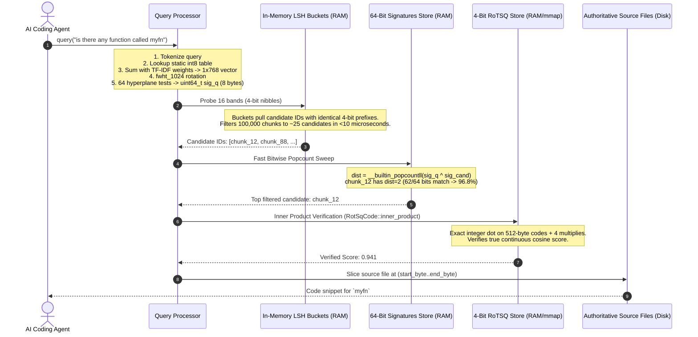

# Binary Hamming Distance Embedding & Sub-Millisecond Retrieval

To achieve sub-millisecond semantic retrieval across hundreds of thousands of code symbols without requiring GPU hardware or incurring multi-hour neural model indexing passes, `groundcontrol` and `codebase-memory-mcp` implement an **Algorithmic Binary Hamming Embedding Architecture**.

This document specifies the end-to-end mathematical pipeline, the dimensional reduction from 2D token matrices to 1D vectors, the orthonormal Hadamard rotation, and the single-cycle bitwise Hamming matching mechanics.

* **Reference C Pipeline**: [`pass_semantic_edges.c`](file:///c:/dev/ctx/codebase-memory-mcp/src/pipeline/pass_semantic_edges.c), [`rotsq.c`](file:///c:/dev/ctx/codebase-memory-mcp/src/semantic/rotsq.c), [`semantic.c`](file:///c:/dev/ctx/codebase-memory-mcp/src/semantic/semantic.c)
* **Pure Rust Specification**: [`RFC-algorithmic-semantic-bridging.md`](file:///c:/dev/ctx/groundcontrol/docs/roadmap/RFC-algorithmic-semantic-bridging.md)

---

## 1. The Pretrained Token Embedding Dictionary

Rather than executing a multi-layer neural network forward pass at indexing or query time, the system utilizes a compiled, zero-copy lookup table:

* **Source**: Extracted from the input embedding matrix ($W_e \in \mathbb{R}^{V \times 768}$) of code models (e.g. `nomic-embed-code` / `jina-embeddings-v2-base-code`).
* **Format**: 40,856 code-domain tokens $\times$ 768 dimensions in `int8` unit-normalized format (~30 MB total).
* **Storage**: Baked directly into the binary executable via safe-Rust `include_bytes!` (or assembler `.incbin` in C).
* **Retrieval Cost**: Looking up any token's 768-D representation is an $O(1)$ pointer dereference taking $\sim 5$ nanoseconds:
  $$\text{ptr} = \text{BLOB} + (\text{token\_id} \times 768)$$

Tokens not found in the static vocabulary fall back to a deterministic, pseudo-random sparse projection seeded by `XXH3_64bits(token)` with 8 non-zero entries ($\pm 1$).

---

## 2. Chunk Encoding: From 2D Token Matrix to 1D Vector

When a code snippet or function is parsed by the [cAST engine](file:///c:/dev/ctx/groundcontrol/docs/architecture/implementation/cast-chunking.md):

```javascript
// Scope: myfn
function myfn = () => { console.log(gubbins); }
```

### 2.1 Lexical Salience (TF-IDF Weighting)
The sequence is tokenized into identifiers, callees, and parameter tokens: `["myfn", "console", "log", "gubbins"]`.
Each token is assigned an Inverse Document Frequency weight:
$$\text{IDF}(t) = \ln\left(1 + \frac{N}{\text{DF}(t)}\right)$$
Common language keywords receive near-zero weights, while distinct identifiers receive high weights.

### 2.2 Sequence & Co-occurrence Enrichment (Reflective Random Indexing)
To capture distributional semantic relationships between tokens without attention layers, the corpus runs a sliding-window ($\pm 5$ tokens) **Reflective Random Indexing (RRI)** pass:
1. **Pass 1**: Each token accumulates scaled vector contributions from its immediate sequential neighbors.
2. **Pass 2**: Tokens are re-enriched using the normalized output of Pass 1 ($\alpha=0.3$ context, $\beta=0.7$ original base vector).
3. The resulting token vectors are contextually conditioned on their neighboring terms within the codebase.

### 2.3 Dimensionality Reduction: 2D Matrix $\rightarrow$ 1D Vector
The $T$ rows of 768-dimensional token vectors (shape $[T \times 768]$) are collapsed along the token axis into **one single 1D vector** ($\mathbb{R}^{768}$) via weighted vector superposition:

$$\mathbf{v}_{\text{chunk}} = \sum_{t=1}^{T} \text{IDF}(t) \cdot \mathbf{v}_{\text{enriched}}(t)$$

Followed by Euclidean unit normalization:
$$\mathbf{v}_{\text{chunk}} \leftarrow \frac{\mathbf{v}_{\text{chunk}}}{\|\mathbf{v}_{\text{chunk}}\|_2}$$

```
2D Token Matrix [T x 768]             1D Chunk Vector [1 x 768]
┌────────────────────────────┐
│ row 0 ("myfn"):    768d    │ × IDF
│ row 1 ("console"): 768d    │ × IDF   ──────►   v_chunk: [1 x 768 floats]
│ row 2 ("log"):     768d    │ × IDF             (Unit-normalized)
│ row 3 ("gubbins"): 768d    │ × IDF
└────────────────────────────┘
```

The 2D matrix exists only transiently in CPU registers/L1 cache during the accumulation loop.

---

## 3. Orthonormal Rotation & 64-Bit Quantization

Raw semantic vectors often exhibit heavy coordinate tails and dimensional correlations. To make 1-bit quantization optimal, the vector is made isotropic via an orthonormal rotation.

```
                  768-D Vector (v_chunk)
                            │
                            ▼ Zero-pad to next power of 2
                 1024-D Vector (Padded)
                            │
                            ▼ Element-wise multiply by diag[d] ∈ {-1, +1}
                 Random Sign Inversion (D)
                            │
                            ▼ Fast Walsh-Hadamard Transform (FWHT) in O(D log D)
                 Rotated Vector (H · D · v)
                            │
                            ▼ Scale by 1 / sqrt(1024) = 1/32
                 Isotropic Rotated Vector x_rot (Near-Gaussian coordinates)
                            │
              ┌─────────────┴─────────────┐
              ▼                           ▼
    64 Hyperplane Sign Tests       4-Bit Scalar Quantization
    (dot(x_rot, w_h) > 0)          (15 uniform bins over [lo, hi])
              │                           │
              ▼                           ▼
    64-Bit Binary Signature        4-Bit RoTSQ Code (RotSqCode)
    uint64_t (8 bytes)             512 bytes + 12B metadata
    [Used for O(1) LSH Search]    [Used for exact dot verification]
```

### 3.1 Fast Walsh-Hadamard Transform (FWHT)
1. **Zero-Padding**: $\mathbf{v}_{\text{chunk}}$ is padded from 768 to 1024 dimensions ($D=1024=2^{10}$).
2. **Deterministic Sign Flip**: Coordinates are multiplied by a reproducible $\pm 1$ diagonal matrix seeded via `XXH3_64bits_withSeed`:
   $$x'_d = x_d \cdot \text{diag}[d], \quad \text{diag}[d] \in \{-1, +1\}$$
3. **FWHT Butterfly**: Computed in-place in $O(D \log D)$ time ($1024 \times 10 = 10{,}240$ operations):
   ```rust
   pub fn fwht_1024(v: &mut [f32; 1024]) {
       let mut len = 1;
       while len < 1024 {
           let step = len << 1;
           for i in (0..1024).step_by(step) {
               for j in i..(i + len) {
                   let a = v[j];
                   let b = v[j + len];
                   v[j] = a + b;
                   v[j + len] = a - b;
               }
           }
           len = step;
       }
   }
   ```
4. **Scale**: Scaled by $\frac{1}{\sqrt{D}} = \frac{1}{32}$. By the Central Limit Theorem, the coordinates of the rotated vector $\mathbf{x}_{\text{rot}}$ are independent, zero-mean Gaussian distributed ($\mathcal{N}(0, \frac{1}{D})$).

### 3.2 64-Bit Hyperplane Projection
64 deterministic random hyperplanes $\mathbf{w}_0 \dots \mathbf{w}_{63} \in \mathbb{R}^{1024}$ are generated using seeded xxHash pseudo-random values.
For each hyperplane $h \in [0..63]$:
$$\text{bit}_h = \begin{cases} 1 & \text{if } \langle \mathbf{x}_{\text{rot}}, \mathbf{w}_h \rangle > 0 \\ 0 & \text{otherwise} \end{cases}$$

All 64 bits are packed into a single 64-bit word (`uint64_t signature` / `u64`).

### 3.3 Charikar's Angle-to-Hamming Equivalence
For any two vectors $\mathbf{u}, \mathbf{v}$ with angle $\theta = \arccos\left(\frac{\mathbf{u} \cdot \mathbf{v}}{\|\mathbf{u}\| \|\mathbf{v}\|}\right)$:
$$P(\text{bit}_h(\mathbf{u}) = \text{bit}_h(\mathbf{v})) = 1 - \frac{\theta}{\pi}$$
The normalized Hamming distance between signatures directly tracks continuous angular distance:
$$\mathbb{E}\left[\frac{D_H(\mathbf{s}_u, \mathbf{s}_v)}{64}\right] = \frac{\theta}{\pi}$$

---

## 4. Query Execution & In-Memory Matching

When an agent issues a search query (e.g. `"is there any function called myfn"`):



### 4.1 Multi-Band LSH Candidate Pruning
To prevent $O(N)$ sweeps across large codebases, the 64-bit signature is partitioned into:
* $b = 16$ bands
* $r = 4$ rows (bits per band)
* 65,536 hash buckets per band

Functions colliding in $\ge 1$ bucket are admitted as candidates. The collision probability follows an S-curve:
$$P(\text{collision}) = 1 - \left(1 - \left(1 - \frac{\theta}{\pi}\right)^4\right)^{16}$$
Pairs with high cosine similarity ($\theta \le 30^\circ$) collide with $>95\%$ probability, while dissimilar pairs ($\theta \ge 75^\circ$) have near-zero collision probability.

### 4.2 Single-Cycle Popcount Verification
For all candidates admitted by LSH, the CPU calculates Hamming distance using the hardware `POPCNT` instruction:
```rust
let hamming_dist = (sig_query ^ sig_candidate).count_ones();
```
This executes in **1 CPU clock cycle** (~0.3 nanoseconds).

---

## 5. Summary of Representations

| Stage | Data Representation | Resident Memory | Computation |
|---|---|---|---|
| **Raw Tokens** | $T$ strings | Transient in L1 cache | AST walk |
| **Token Table** | $40,856 \times 768$ `int8` | 30 MB (Read-Only static data) | Zero-copy pointer offset |
| **Chunk Vector** | $1 \times 768$ `f32` | Transient stack buffer | TF-IDF weighted vector accumulation |
| **Rotated Vector** | $1 \times 1024$ `f32` | Transient stack buffer | In-place `fwht_1024` butterfly ($10{,}240$ ops) |
| **Binary Signature** | `uint64_t` (`u64`) | **8 bytes per chunk** | 64 dot product signs; 1-cycle `POPCNT` |
| **RoTSQ Code** | [`RotSqCode`](file:///c:/dev/ctx/groundcontrol/docs/roadmap/RFC-algorithmic-semantic-bridging.md#L307) | 524 bytes per chunk | 4-bit integer dot product verification |
