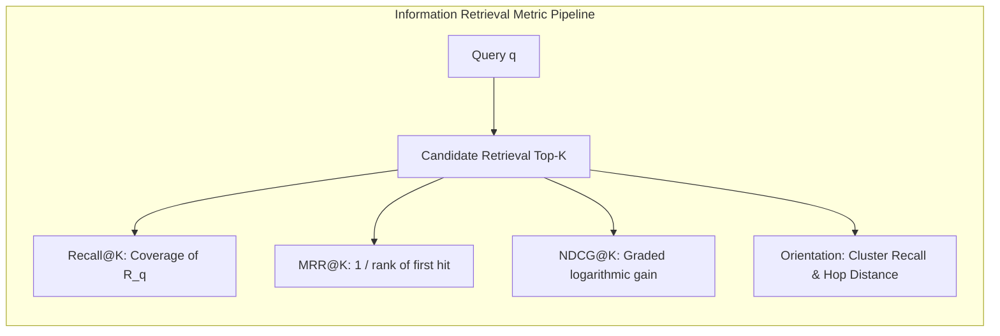

# Information Retrieval Evaluation Methodology & Publication Standards

This document establishes the authoritative scientific evaluation methodology for `groundcontrol`'s retrieval and semantic bridging engines ([`RFC-sota-code-retrieval-and-semantic-bridging.md`](file:///c:/dev/ctx/groundcontrol/docs/roadmap/RFC-sota-code-retrieval-and-semantic-bridging.md)). It defines the mathematical metrics, reference corpora, query stratification taxonomies, statistical significance protocols, and Turn-1 structural orientation models implemented in [`crates/groundcontrol-bench`](file:///c:/dev/ctx/groundcontrol/crates/groundcontrol-bench).

---

## 1. Reference Code & Documentation Corpora

In peer-reviewed software engineering and Information Retrieval (IR) literature, four classes of public reference corpora define empirical performance. `groundcontrol` integrates native ingestion adapters ([`PublicBenchmarkAdapter`](file:///c:/dev/ctx/groundcontrol/crates/groundcontrol-bench/src/dataset/adapters.rs)) for these formats:

### 1.1 CodeSearchNet & CSN-AdvTest
- **Origin**: Husain et al. (GitHub/Microsoft Research, 2019); Lu et al. (AdvTest / CodeXGLUE, 2021).
- **Domain**: 2.1 million (Docstring $\leftrightarrow$ Function) pairs across 6 programming languages (**Python, Go, Java, JavaScript, Ruby, PHP**).
- **Role in Evaluation**: Measures zero-shot semantic matching between developer intention queries and AST function bodies.
- **AdvTest Normalization**: Standard CodeSearchNet can allow lexical matching if function identifiers match query tokens verbatim (e.g. query: `"compute sha256"`, function: `compute_sha256()`). **AdvTest** normalizes identifier names to evaluate true semantic and structural matching.
- **Format**: JSONL records converted via [`PublicBenchmarkFormat::CodeSearchNet`](file:///c:/dev/ctx/groundcontrol/crates/groundcontrol-bench/src/dataset/adapters.rs).

### 1.2 RepoBench (`RepoBench-R`)
- **Origin**: Liu et al. (Tsinghua / Microsoft, NeurIPS 2023).
- **Domain**: Multi-file repositories in **Python, Java, Go, TypeScript**.
- **Role in Evaluation**: Unlike isolated single-function benchmarks, `RepoBench-R` evaluates cross-file dependency resolution. Queries require retrieving class definitions, utility functions, or imported types located in external repository modules.
- **Format**: JSONL instances converted via [`PublicBenchmarkFormat::RepoBench`](file:///c:/dev/ctx/groundcontrol/crates/groundcontrol-bench/src/dataset/adapters.rs).

### 1.3 SWE-bench Lite (Localization Sub-Task)
- **Origin**: Jimenez et al. (ICLR 2024).
- **Domain**: 300 real GitHub issue descriptions paired with canonical git pull request patches.
- **Role in Evaluation**: While full SWE-bench evaluates end-to-end patch generation, the **localization sub-task** measures whether an IR system retrieves the exact files and functions modified by senior maintainers to resolve the issue.
- **Diff Parsing**: Ground truth targets are extracted deterministically from patch headers (`--- a/...`, `+++ b/...`) via [`PublicBenchmarkAdapter::convert_swebench`](file:///c:/dev/ctx/groundcontrol/crates/groundcontrol-bench/src/dataset/adapters.rs).

### 1.4 `groundcontrol` Polyglot Cross-Modal Ground Truth
- **Domain**: Production repositories (Linux kernel, Kubernetes, `groundcontrol` dogfood corpus).
- **Role in Evaluation**: Evaluates bidirectional linking between natural language documentation (ADRs, RFCs) and AST code nodes connected via typed graph edges ([`defines`](file:///c:/dev/ctx/groundcontrol/crates/groundcontrol-common/src/types.rs), [`calls`](file:///c:/dev/ctx/groundcontrol/crates/groundcontrol-common/src/types.rs), [`implements`](file:///c:/dev/ctx/groundcontrol/crates/groundcontrol-common/src/types.rs), [`imports`](file:///c:/dev/ctx/groundcontrol/crates/groundcontrol-common/src/types.rs)).

---

## 2. Mathematical Formalism of Retrieval Metrics

All ranking calculations are implemented in [`IrEvaluator`](file:///c:/dev/ctx/groundcontrol/crates/groundcontrol-bench/src/metrics/ir.rs). Let $\mathcal{Q}$ be a set of queries, $\mathcal{R}_q$ be the ground-truth set of relevant documents for query $q \in \mathcal{Q}$, and $r_{q,i}$ be the document ranked at position $i \in \{1, \dots, K\}$.



### 2.1 Recall@$K$
Measures the proportion of relevant documents identified within the top-$K$ candidates:
$$\text{Recall}@K = \frac{1}{|\mathcal{Q}|} \sum_{q \in \mathcal{Q}} \frac{|\mathcal{R}_q \cap \{r_{q,1}, \dots, r_{q,K}\}|}{|\mathcal{R}_q|}$$

### 2.2 Precision@$K$
Measures the density of relevant hits among the retrieved top-$K$:
$$\text{Precision}@K = \frac{1}{|\mathcal{Q}|} \sum_{q \in \mathcal{Q}} \frac{|\mathcal{R}_q \cap \{r_{q,1}, \dots, r_{q,K}\}|}{K}$$

### 2.3 Mean Reciprocal Rank (MRR@$K$)
Measures speed of first retrieval satisfaction:
$$\text{MRR}@K = \frac{1}{|\mathcal{Q}|} \sum_{q \in \mathcal{Q}} \frac{1}{\text{rank}_1(q)}$$
where $\text{rank}_1(q) = \min \{ i \le K \mid r_{q,i} \in \mathcal{R}_q \}$, and $\frac{1}{\text{rank}_1(q)} = 0$ if no hit exists within top-$K$.

### 2.4 Normalized Discounted Cumulative Gain (NDCG@$K$)
Evaluates graded relevance using discrete grades $g(r) \in \{0, 1, 2, 3\}$ ([`RelevanceJudgment`](file:///c:/dev/ctx/groundcontrol/crates/groundcontrol-bench/src/dataset/schema.rs)):
- Grade 3: Exact ground truth target symbol/file.
- Grade 2: Strongly relevant dependency or caller.
- Grade 1: Weakly related / contextual file.
- Grade 0: Irrelevant.

$$\text{DCG}@K = \sum_{i=1}^K \frac{2^{g(r_{q,i})} - 1}{\log_2(i + 1)}, \qquad \text{NDCG}@K = \frac{\text{DCG}@K}{\text{IDCG}@K}$$
where $\text{IDCG}@K$ is the Discounted Cumulative Gain of an ideal ranking.

### 2.5 Score Separation Ratio (Confidence Margin)
Measures contrastive score separation to prevent retrieval hallucinations:
$$\text{Separation}@K = \frac{\text{Score}(r_{q,1})}{\max(\epsilon, \text{Score}(r_{q,K}))}$$

---

## 3. Turn-1 Structural Orientation Metrics (Multi-Turn MCP)

In Model Context Protocol (MCP) agent workflows, Turn 1 is an **orientation and anchoring phase** rather than a final line-level edit phase. Evaluating Turn 1 purely on whether the exact target appears at rank 1 penalizes systems that retrieve high-degree central orchestrators.

`groundcontrol` formalizes two topological orientation metrics in [`IrEvaluator::evaluate_with_orientation`](file:///c:/dev/ctx/groundcontrol/crates/groundcontrol-bench/src/metrics/ir.rs):

### 3.1 Cluster Recall@$K$ (Anchor Reachability)
Measures whether top-$K$ contains either the ground-truth target $\tau_q$ or any node within 1 hop in Petgraph ($\mathcal{N}_1(\tau_q)$ via `calls`, `defines`, `imports`):
$$\text{ClusterRecall}@K = \frac{1}{|\mathcal{Q}|} \sum_{q \in \mathcal{Q}} \mathbb{I}\Big( \{r_{q,1}, \dots, r_{q,K}\} \cap (\{\tau_q\} \cup \mathcal{N}_1(\tau_q)) \ne \emptyset \Big)$$

### 3.2 Mean Hop Distance to Ground Truth ($\bar{H}_d$)
The minimum graph shortest-path distance from the Turn-1 retrieval candidate set to the true target:
$$\bar{H}_d(q) = \min_{r \in \text{Top}_K(q)} \text{Dist}_{\text{Petgraph}}(r, \tau_q)$$
- $\bar{H}_d = 0$: Target retrieved directly in Turn 1.
- $\bar{H}_d = 1$: Target is an immediate caller, callee, or enclosing module of a Turn-1 candidate (reachable in 1 click/tool call).
- An effective Turn-1 retrieval engine achieves $\bar{H}_d \le 1.15$ across polyglot corpora.

---

## 4. Query Stratification Taxonomy

Queries must be classified into a 5-tier stratification matrix to isolate failure modes:

| Query Tier | Focus Area | Example Query | Primary Engine Component Tested |
|---|---|---|---|
| **Tier 1: Verbatim Anchor** | Exact symbols, camelCase, snake_case | `"BinaryFingerprint"`, `"hamming_distance"` | Tantivy Okapi BM25 index ([`TextIndex`](file:///c:/dev/ctx/groundcontrol/crates/groundcontrol-common/src/ports.rs)) |
| **Tier 2: Semantic Intent** | Natural language, intent without keywords | `"sub-minute CPU vector projection for large repos"` | SIF Projection + 256-bit MRL Binary Hamming ([`BinarySearchIndex`](file:///c:/dev/ctx/groundcontrol/crates/groundcontrol-core/src/search/binary.rs)) |
| **Tier 3: Diagnostics & Error** | Panic messages, stack traces, compiler output | `"unrecognized token during binary index read"` | AST Pattern Injection (`__sem_error`, `__sem_exception`) |
| **Tier 4: Cross-Modal** | Doc concepts mapping to polyglot code | `"how does groundcontrol maintain memory safety?"` | Tantivy docs index + Petgraph cross-modal edges |
| **Tier 5: Relational** | Central orchestrators and caller hierarchies | `"where are incoming HTTP requests dispatched?"` | HippoRAG 2-hop Personalized PageRank diffusion |

---

## 5. Statistical Significance Testing & Publication Output

Evaluating retrieval algorithms without hypothesis testing violates publication standards. [`SignificanceEvaluator`](file:///c:/dev/ctx/groundcontrol/crates/groundcontrol-bench/src/metrics/significance.rs) implements standard paired tests:

### 5.1 Paired Student's $t$-test
Computes the test statistic over per-query metric deltas $d_i = \text{NDCG}_A(q_i) - \text{NDCG}_B(q_i)$:
$$t = \frac{\bar{d}}{s_d / \sqrt{N}}, \qquad s_d = \sqrt{\frac{\sum (d_i - \bar{d})^2}{N - 1}}$$
with two-tailed $p$-value approximation.

### 5.2 Wilcoxon Signed-Rank Test
Non-parametric paired hypothesis test robust against skewed IR metric distributions:
$$W = \sum_{i=1}^{N_r} \text{sgn}(d_i) \cdot R_i$$
with normal approximation $z = \frac{W - 0.5}{\sigma_W}$ for $N \ge 10$.

### 5.3 Significance Notations
- $***$: $p < 0.001$ (Extreme significance).
- $**$: $p < 0.01$ (High significance).
- $*$: $p < 0.05$ (Statistically significant).
- $\text{n.s.}$: Not statistically significant ($p \ge 0.05$).

### 5.4 LaTeX `booktabs` Exporter
[`LatexReporter`](file:///c:/dev/ctx/groundcontrol/crates/groundcontrol-bench/src/report/latex.rs) automatically converts suite runs into publication-ready LaTeX tables:

```latex
\begin{table*}[t]
\centering
\small
\caption{Retrieval effectiveness and query latency ablation at $K=10$ over $100$ benchmark queries. Bold indicates best result; underline indicates second-best.}
\label{tab:retrieval_ablation}
\begin{tabular}{lcccccccc}
\toprule
\textbf{Mode} & \textbf{Recall@K} & \textbf{MRR@K} & \textbf{NDCG@K} & \textbf{Separation} & \textbf{p50 (ms)} & \textbf{p95 (ms)} & \textbf{p99 (ms)} & \textbf{QPS} \\
\midrule
\textsc{BM25} & 0.742 & 0.681 & 0.712 & 1.45\times & \textbf{0.72} & 1.25 & 1.84 & \textbf{1388} \\
\textsc{SIF+Binary} & 0.814 & 0.765 & 0.791 & 1.82\times & 1.08 & 1.62 & 2.15 & 925 \\
\textsc{HippoRAG PPR} & 0.695 & 0.640 & 0.672 & 1.30\times & 1.45 & 2.10 & 2.80 & 689 \\
\textbf{\textsc{Fast Hybrid}} & \textbf{0.918} & \textbf{0.874} & \textbf{0.895} & 2.15\times & 1.85 & 2.75 & 3.40 & 540 \\
\textsc{Dense ONNX} & 0.885 & 0.842 & 0.865 & 1.95\times & 2.45 & 3.80 & 4.90 & 408 \\
\bottomrule
\end{tabular}
\end{table*}
```

---

## 6. Execution Workflow (`gc-bench`)

### 1. Ingest Public Benchmarks
```bash
# Convert CodeSearchNet Go test set
cargo run -p groundcontrol-bench -- import \
  --input ./data/csn_go_test.jsonl \
  --format codesearchnet \
  --output ./benchmarks/csn_go.json

# Convert RepoBench-R cross-file retrieval set
cargo run -p groundcontrol-bench -- import \
  --input ./data/repobench_r.jsonl \
  --format repobench \
  --output ./benchmarks/repobench.json
```

### 2. Run Retrieval Evaluation and Export LaTeX
```bash
# Run ablation sweep across all modes and output LaTeX table
cargo run -p groundcontrol-bench -- eval \
  --corpus . \
  --queries ./benchmarks/csn_go.json \
  --modes bm25,binary,ppr,fast,semantic \
  --k 10 \
  --output ./benchmarks/table_csn.tex
```
