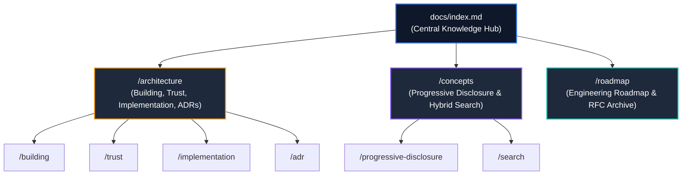

# groundcontrol Knowledge Corpus Hub

Welcome to the central technical documentation and knowledge corpus for **groundcontrol** (`gc`), the enterprise semantic Model Context Protocol (MCP) server for AI coding agents, written in 100% pure safe Rust (`#![forbid(unsafe_code)]`).

This documentation is organized into three core technical pillars following **Principle 3: Continuous Knowledge Crystallization**. Rather than leaving technical designs in ephemeral session traces, every architectural decision, mathematical proof, and systems design is documented as a dense, cross-linked, schema-validated markdown asset.

---

## Global Corpus Topology Graph

---

## The Three Core Documentation Pillars

### 1. 🏗️ [[docs/architecture/index]] (Systems Architecture & Engineering)
* **Building & Operations**: Standalone binaries, Cargo MSRV builds, and IDE agent setup via [[docs/architecture/building/index]].
* **Trust & Safety**: Authoritative ground truth on disk, deterministic graphs, and `#![forbid(unsafe_code)]` via [[docs/architecture/trust/index]].
* **Implementation Internals**: Hexagonal ports and adapters, cAST Tree-sitter chunking, DirectML GPU governor, and federation via [[docs/architecture/implementation/index]].
* **Architectural Decisions (ADR Catalog)**: Complete registry of 17 formal architectural decision records (ADR 001–017) via [[docs/architecture/adr/index]].

### 2. 🧠 [[docs/concepts/index]] (Theoretical Paradigms & Retrieval)
* **Progressive Disclosure**: Strict 3-tier retrieval contract (Tier 1 search $\to$ Tier 2 symbol $\to$ Tier 3 lines), Turn 1 affordances, and swarm topologies via [[docs/concepts/progressive-disclosure/index]].
* **Search & Multimodal Retrieval**: 4-modality hybrid search, Reciprocal Rank Fusion (RRF, $k=60$) mathematics, Tantivy BM25, and dense ONNX vector spaces via [[docs/concepts/search/index]].

### 3. 🗺️ [[docs/roadmap/index]] (Roadmap & RFC Archive)
* **Codebase Roadmap**: Long-term technical evolution and milestones via [[docs/roadmap/coderoadmap]].
* **Architectural RFCs**: Implemented specifications for cross-corpus federation, adaptive graph expansion, zero-copy binary storage, and AST chunking.
