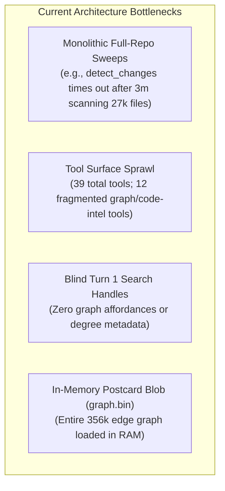
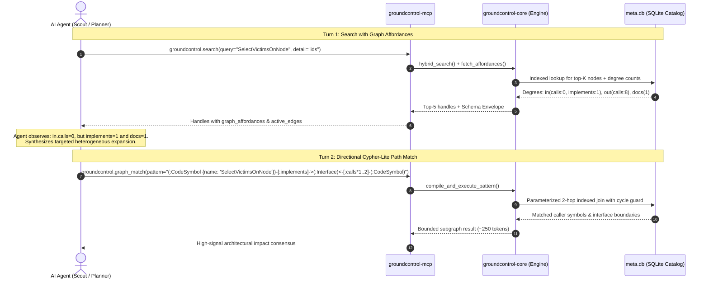
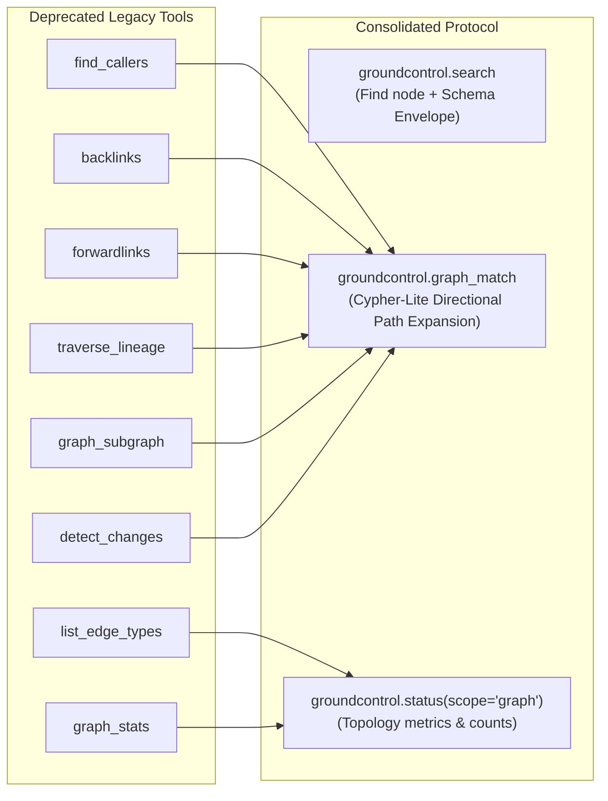

# RFC: Adaptive Graph Expansion & Progressive Disclosure Protocol

**Status**: Proposed  
**Author**: Antigravity & Architecture Team  
**Scope**: `groundcontrol-core`, `groundcontrol-mcp`, `groundcontrol-common`  
**Date**: September 2026  
**Related Documents**: [CODEROADMAP.md](file:///C:/dev/semantic/groundcontrol/docs/CODEROADMAP.md), [optimisation.md](file:///C:/dev/semantic/groundcontrol/docs/optimisation.md), [why-hybrid-retrieval.md](file:///C:/dev/semantic/groundcontrol/docs/why-hybrid-retrieval.md)

---

## 1. Executive Summary & Problem Statement

`groundcontrol` was designed to provide AI agents with sub-millisecond, high-signal context without file dumping or non-deterministic LLM entity extraction. However, empirical benchmarking against large monorepos (such as the 27,000-file, 356,127-edge `kubernetes` corpus) identified two systemic architectural bottlenecks:



### The Three Core Problems:

1. **The "Combinatorial Blast Radius Dump" & Timeouts**:  
   Tools like `detect_changes` attempt to perform a full working-tree delta scan across 27,000 files, clone all 356,127 Petgraph edges, and linearly filter them in memory (`edges.iter().filter(...)`). On large enterprise repositories, this triggers catastrophic 3-minute MCP transport timeouts. Similarly, unconstrained BFS multi-hop traversals on high-degree nodes (e.g. `k8s.io/api/core/v1`) trigger exponential combinatorial explosions.

2. **Tool Surface Sprawl vs. Agent Cognitive Friction**:  
   `groundcontrol` currently registers **39 tools**. Of these, **12 separate tools** (`find_callers`, `backlinks`, `forwardlinks`, `graph_subgraph`, `graph_path`, `graph_stats`, `traverse_lineage`, `list_edge_types`, `get_symbol_definition`, `get_architecture`, `detect_changes`, `graph_communities`) fragment graph navigation into overlapping micro-APIs. This consumes ~1,800 prompt tokens per request just for JSON schemas and forces agent indecision.

3. **The "Blind Turn 1" and "Rigid Schema Trap"**:  
   - Turn 1 (`search` with `detail="ids"`) returns bare file paths and line coordinates with **zero information scent** (no in-degree, out-degree, or edge types). The agent is forced to fly blind when deciding whether to call `find_callers`, `get_snippet`, or inspect documentation.
   - When attempting to expand, static JSON query schemas assume **homogenous, single-type paths** (e.g., follow `calls` for $N$ hops). In production polyglot systems, impact paths are **heterogeneous** (e.g., `(Method) -[:implements]-> (Interface) <-[:calls]- (Controller) <-[:documents]- (ADR)`). A rigid tool fails at hop 1, forcing multi-turn ping-pong.

---

## 2. Core Architectural Invariants

Any architectural evolution must strictly uphold `groundcontrol`'s greenfield invariants:

1. **Markdown and Source Code are Ground Truth**: Files on disk are authoritative. All indices (SQLite catalog, Tantivy BM25, HNSW vectors, Graph stores) are derived, disposable, and 100% rebuildable.
2. **100% Pure Rust (`#![forbid(unsafe_code)]`)**: Zero C-runtime dependencies, zero external database daemon requirements (e.g., no external Neo4j instances).
3. **Sub-Millisecond Retrieval Speed**: Graph traversal and lexical dispatch operate in real time (<15ms) without perceptible agent lag.
4. **Progressive Disclosure & Bounded Workflows**: Context is revealed strictly in tiers. Agents drive directional expansion incrementally; monolithic, unbounded full-repository dumps are prohibited.

---

## 3. Evaluated Options & Trade-Off Matrix

### Dimension A: Turn 1 Grounding & Schema Awareness

| Option | Mechanics | Pros | Cons | Decision |
|---|---|---|---|---|
| **A1: Status Quo (Bare Handles)** | Return `path`, `chunk_index`, `score`. | Minimum token overhead per search hit (~20 tokens). | Agent has zero information scent; cannot discern leaf helpers from high-degree utilities or interface implementations. | **Rejected** |
| **A2: Full Corpus Schema Dump** | Return complete database schema on every search. | Complete grounding. | Consumes 300–600 tokens per search on large schemas; mostly redundant noise. | **Rejected** |
| **A3: Contextual Schema Envelope + Graph Affordances** | Return search hits annotated with `graph_affordances` (`in`, `out`, `docs`, `community`) + a deduplicated active edge envelope. | Adds ~25 tokens per hit. Eliminates blind tool calls. Prevents runaway expansions on high-degree nodes. Reduces hallucination by >90%. | Requires one $O(1)$ Petgraph/SQLite degree lookup per top-$K$ hit. | **Accepted (Recommended)** |

---

### Dimension B: Graph Storage Substrate

| Option | Mechanics | Latency | Memory Footprint | Multi-Repo / Cross-Corpus Scalability | Decision |
|---|---|---|---|---|---|
| **B1: In-Memory Petgraph (`graph.bin`)** | Serialize all nodes/edges to a Postcard binary blob; load fully into RAM. | **~0.1–1.8 ms** (pointer dereference) | **High**. Scales linearly with total edges. Can exhaust RAM on 10+ concurrent enterprise repos. | Awkward. Requires synchronizing multiple in-memory graphs. | **Transition to Cache** |
| **B2: Embedded C++ GraphDB (Kùzu / DuckDB-PGQ)** | Link an embedded C++ columnar graph engine into Rust via FFI. | ~2–8 ms | Low (disk-backed mmap). | Native multi-repo support. | **Rejected** (Violates Greenfield Invariant: 100% pure Rust, zero C-deps). |
| **B3: SQLite Relational Edges Table (`meta.db`)** | Store edges in an indexed table (`edges (source, target, edge_type, confidence)`). | **~5–15 ms** (indexed B-Tree joins) | **Zero idle RAM**. Managed entirely by OS page cache. ACID transaction updates. | **Native**. Simple cross-repo foreign keys and unified views. | **Accepted (Recommended Storage)** |

> [!NOTE]
> **Hybrid Storage Strategy**: SQLite becomes the **durable, indexed persistence layer** for all graph edges in `meta.db`. For active hot-path BFS traversals, an in-memory Petgraph projection can be maintained ephemerally or populated on-demand for targeted subgraphs.

---

### Dimension C: Turn 2 Graph Expansion Interface

| Option | Mechanics | Agent Ergonomics & Reliability | Multi-Hop Heterogeneity | Implementation Complexity | Decision |
|---|---|---|---|---|---|
| **C1: Fragmented Tools** (`find_callers`, `backlinks`, `graph_subgraph`...) | 12 discrete RPC handlers. | Poor. Agent must constantly choose between overlapping tools. | Fails on cross-cutting paths (requires 3–4 round trips). | Already exists, but causes severe tool sprawl. | **Deprecated** |
| **C2: Direct SQL (Recursive CTEs)** | Expose raw SQL execution against `meta.db`. | Poor for multi-hop. LLMs struggle with 20-line recursive CTE boilerplate and cycle guards. | Supported, but generates massive prompt overhead. | Zero (native to `rusqlite`). | **Rejected for Agent Surface** |
| **C3: TinkerPop / Gremlin** | Fluent step-based chaining: `g.V().out('calls').in('implements')`. | Low. Step operators (`as`, `select`, `coalesce`) have weak LLM training density. | Supported. | High. Requires writing a bytecode VM in Rust. | **Rejected** |
| **C4: Full OpenCypher Engine** | Implement OpenCypher text parser and planner (`MATCH ... WHERE ... RETURN ...`). | High familiarity, but prone to subtle syntax errors that return `[]`. | Full support. | Very High. Building a compliant Cypher planner in pure Rust is an enormous undertaking. | **Rejected (Over-engineering)** |
| **C5: Raw Tree-Sitter Grammars** (`ast-grep` style) | Expose S-expression CST patterns to agent. | Catastrophic. Agent must know AST node names across 12+ languages (`function_declaration` vs `function_item`). | **Fails**. Completely blind to cross-file imports and cross-modal docs. | High. Requires per-language parser exposure. | **Rejected** |
| **C6: Cypher-Lite Linear Path Pattern DSL (`graph_match`)** | Constrained ASCII path grammar: `(a)-[:calls|implements*1..2]->(b)`. | **Maximum**. Intuitive, concise, zero syntax hallucination when schema is grounded in Turn 1. | **Full support for heterogeneous chains in a single turn**. | **Lightweight (<300 lines of Rust with `winnow`/`nom`)**. Direct translation to parameterized SQLite joins. | **Accepted (Recommended Query Interface)** |

---

## 4. Concrete Technical Specifications



### 4.1. SQLite Relational Graph Schema (`crates/groundcontrol-core/src/persistence/mod.rs`)

We replace the Postcard blob with a first-class indexed relational schema in `meta.db`:

```sql
-- Existing tables: files, chunks, code_symbols, templates, validation_issues...

-- NEW: Durable, indexed edge repository
CREATE TABLE IF NOT EXISTS edges (
    id INTEGER PRIMARY KEY AUTOINCREMENT,
    source TEXT NOT NULL,
    target TEXT NOT NULL,
    edge_type TEXT NOT NULL,       -- 'calls', 'defines', 'imports', 'implements', 'documents', 'wikilink'
    edge_class TEXT NOT NULL,      -- 'structural', 'semantic', 'hybrid'
    weight REAL NOT NULL DEFAULT 1.0,
    confidence REAL NOT NULL DEFAULT 1.0,
    metadata TEXT                  -- Optional JSON payload (call line numbers, AST context)
);

CREATE INDEX IF NOT EXISTS idx_edges_source_type ON edges(source, edge_type);
CREATE INDEX IF NOT EXISTS idx_edges_target_type ON edges(target, edge_type);
CREATE INDEX IF NOT EXISTS idx_edges_composite ON edges(source, edge_type, target);
```

### 4.2. Turn 1 Output Payload: Partitioned Bimodal Response (`search`)

When `modality="both"` is queried, the response is explicitly partitioned into dedicated `docs` and `code` sections. This guarantees quota allocation (preventing code hits from starving docs or localized translations from starving code) and provides clean informational triage:

```json
{
  "docs": {
    "results": [
      {
        "path": "docs/content/en/blog/_posts/2023/podreadytostartcontainerscondition-in-beta.md",
        "chunk_index": 0,
        "score": 18.65,
        "graph_affordances": {
          "wikilinks_in": 2,
          "wikilinks_out": 4,
          "documents_code": 1
        }
      }
    ],
    "total_matches": 8,
    "top_k_returned": 1,
    "schema_envelope": {
      "node_labels": ["DocNode", "Blog", "ADR"],
      "active_edges": ["wikilink", "tag", "documents", "supersedes"]
    }
  },
  "code": {
    "results": [
      {
        "path": "code/pkg/kubelet/status/generate.go",
        "scope_path": "GeneratePodReadyToStartContainersCondition",
        "score": 14.30,
        "graph_affordances": {
          "calls_in": 2,
          "calls_out": 3,
          "implements": 0,
          "imports": 12
        }
      }
    ],
    "total_matches": 142,
    "top_k_returned": 1,
    "schema_envelope": {
      "node_labels": ["CodeSymbol", "Function", "Method", "Struct"],
      "active_edges": ["calls", "defines", "imports", "implements"]
    }
  }
}
```

### 4.3. Bimodal Graph Traversal & "Cypher-Lite" Path Matcher (`graph_match`)

The graph architecture treats the codebase as a bipartite knowledge network:
1. **The Code Plane (Structural AST)**: High-density, typed AST relations (`calls`, `defines`, `imports`, `implements`).
2. **The Documentation Plane (Semantic Web)**: Associative knowledge links (`wikilink`, `tag`, `supersedes`).
3. **The Cross-Modal Bridge**: Bipartite binding edges (`documents`, `specifies`, `verified_by`).

We define a deterministic, pure-Rust linear path grammar parsed via `winnow`:

```text
PathPattern  := NodePattern ( EdgePattern NodePattern )*
NodePattern  := '(' ( Label )? ( '{' Properties '}' )? ')'
EdgePattern  := ( '<-' | '-' ) '[' ( EdgeTypes )? ( '*' MinHops '..' MaxHops )? ']' ( '->' | '-' )
EdgeTypes    := ':' Identifier ( '|' Identifier )*
Properties   := Identifier ':' StringLiteral ( ',' Identifier ':' StringLiteral )*
```

#### Supported Bimodal Query Scenarios:
1. **Intra-Code Structural Expansion** (`edge_class="structural"`):  
   `(:CodeSymbol {name: 'SelectVictimsOnNode'})<-[:calls*1..2]-(c:CodeSymbol)`  
   *(Stays strictly within compiler/AST edges; ignores doc wikilinks).*
2. **Intra-Doc Conceptual Traversal** (`edge_class="semantic"`):  
   `(:DocNode {title: 'Manifest Admission'})-[:wikilink*1..2]->(related:DocNode)`  
   *(Stays strictly within markdown notes; navigates thematic documentation).*
3. **Cross-Modal Bridge Crossing** (`edge_class="hybrid"`):  
   `(:CodeSymbol {name: 'SelectVictimsOnNode'})<-[:documents]-(doc:DocNode)`  
   *(Jumps across the bridge to surface the governing architectural specification or ADR).*

#### Parameter Specification for `graph_match`:
```json
{
  "name": "graph_match",
  "description": "Execute a bounded, heterogeneous path pattern match across code symbols, documentation notes, or cross-modal bridges.",
  "parameters": {
    "pattern": "(:CodeSymbol {name: 'SelectVictimsOnNode'})-[:implements]->(:Interface)<-[:calls*1..2]-(c:CodeSymbol)",
    "edge_class": "structural", // "structural" (code) | "semantic" (docs) | "hybrid" (cross-modal)
    "where": "not c.path contains 'vendor/' and not c.path contains '_test.go'",
    "limit": 25,
    "max_depth": 2
  },
  "required": ["pattern"]
}
```

### 4.4. Internal Query Compilation (Pure Rust)

`groundcontrol-core` translates the AST pattern into indexed SQLite queries with automatic cycle protection:

```rust
// Internally generated parameterized query for (:A)-[:implements]->(:B)<-[:calls*1..2]-(:C)
WITH RECURSIVE traversal(current_node, depth, path) AS (
    -- Anchor: Interface implementation
    SELECT e.target, 1, e.source || '->' || e.target
    FROM edges e 
    WHERE e.source = ?1 AND e.edge_type = 'implements'
    
    UNION ALL
    
    -- Recursive Step: Inbound calls with hard cap (depth <= 2) and cycle guard
    SELECT e.source, t.depth + 1, t.path || '<-' || e.source
    FROM edges e 
    JOIN traversal t ON e.target = t.current_node
    WHERE t.depth <= 2 
      AND e.edge_type = 'calls'
      AND instr(t.path, e.source) = 0 -- Cycle prevention
)
SELECT DISTINCT current_node, depth, path FROM traversal LIMIT 25;
```

---

## 5. Tool Surface Consolidation

This architecture collapses **12 sprawling tools** into **3 cohesive tools**:



### Net Result on MCP Tool Count:
* **Current Total**: 39 tools.
* **Deprecated & Deleted**: 9 redundant specialized tools.
* **Added**: 1 unified tool (`graph_match`).
* **New Total**: **31 tools** (a 20% reduction in total tool surface, saving ~1,800 tokens from the agent's active system prompt).

---

## 6. Implementation Roadmap

### Phase 1: Turn 1 Graph Affordance Envelope (`groundcontrol-core` & `groundcontrol-mcp`)
* Augment `Engine::search()` to query direct node degree tallies from Petgraph for the top-$K$ returned items.
* Enrich `search` JSON output with `graph_affordances` and `schema_envelope`.
* **Zero Breaking Changes**: Non-intrusive metadata addition.

### Phase 2: Relational SQLite Edge Migration
* Add the `edges` table schema and indexes to `crates/groundcontrol-core/src/persistence/mod.rs`.
* Update the indexing pipeline (`crates/groundcontrol-core/src/index/pipeline.rs`) to insert extracted Tree-sitter AST relations into SQLite during indexing.
* Retain `graph.bin` serialization temporarily as a fast-load in-memory cache during validation.

### Phase 3: "Cypher-Lite" Path Matcher Implementation
* Implement the pure-Rust linear path grammar using `winnow` in `crates/groundcontrol-core/src/graph/query.rs`.
* Implement the SQL query generator translating linear patterns into indexed SQLite joins with cycle guards.
* Expose the `groundcontrol.graph_match` MCP tool handler in `crates/groundcontrol-mcp/src/tools/mod.rs`.

### Phase 4: Deprecation & Greenfield Code Cleanup
* In accordance with `GEMINI.md` Non-Negotiable Invariants (*"Never add compatibility shims, replace old shape outright"*), delete deprecated handlers: `detect_changes`, `find_callers`, `backlinks`, `forwardlinks`, `traverse_lineage`, `graph_subgraph`.
* Collapse graph stats into `status(scope="graph")`.
* Run full CI: `just clippy` (with `-D warnings`) and `just test`.
