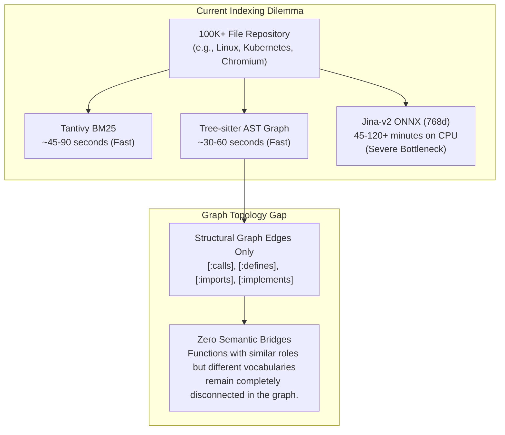
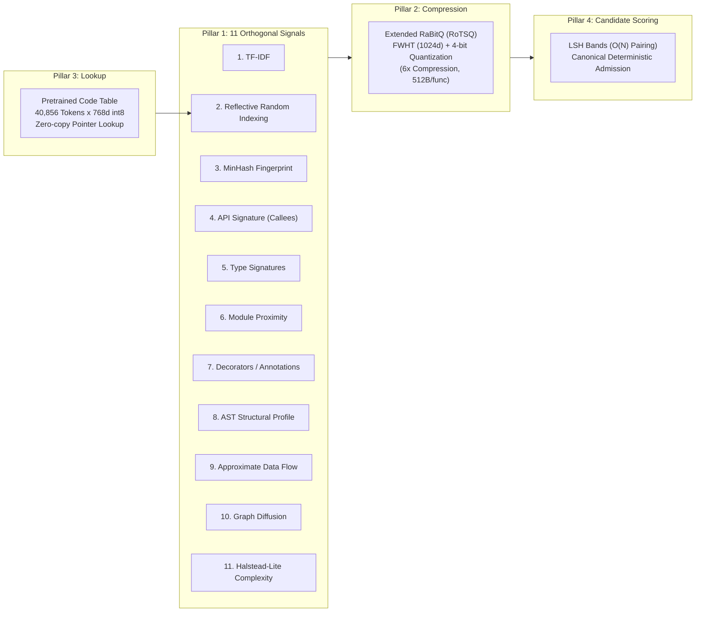
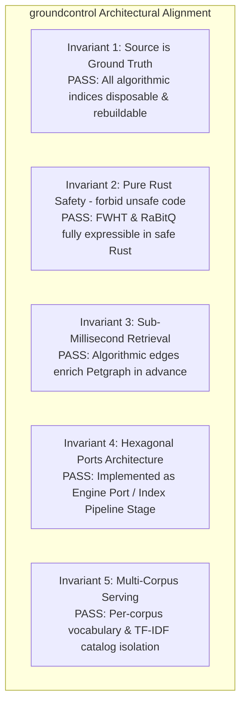
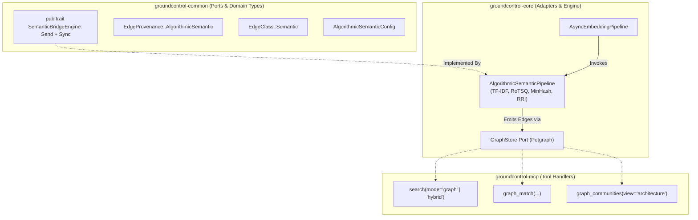
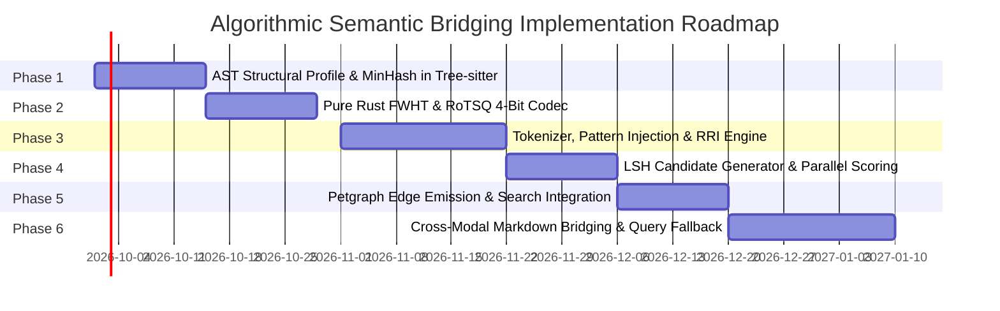

# RFC: Algorithmic Semantic Bridging & Hardware-Independent Code Graph Synthesis

**Status**: Proposed  
**Scope**: `groundcontrol-common`, `groundcontrol-core`, `groundcontrol-mcp`, `groundcontrol-cli`  
**Date**: September 2026  
**Target Version**: `0.2.0`+  
**Related Documents**: [[docs/roadmap/coderoadmap]], [[docs/roadmap/RFC-zero-copy-file-offsets-and-binary-vectors]], [[docs/roadmap/RFC-docs-embed-intermediate-indexing-mode]], [[docs/concepts/search/hybrid-retrieval-theory]], [[docs/roadmap/RFC-sota-code-retrieval-and-semantic-bridging]]

---

## 1. Executive Summary & Empirical Problem Statement

`groundcontrol` delivers high-signal, sub-millisecond context retrieval to AI coding agents via a 4-modality hybrid retrieval architecture (Tantivy Okapi BM25, dense ONNX embeddings via `jina-embeddings-v2-base-code`, and Petgraph typed AST/wikilink graph traversal). While dense neural embeddings provide unmatched natural language comprehension, they create an existential **indexing bottleneck** and leave a major **topological void** in repository graphs.



### 1.1 The Indexing Bottleneck on 100K+ File Repositories
On massive codebases (e.g., Linux kernel with ~75K files / 800K functions, Kubernetes with ~180K files), computing forward passes for dense 768-dimensional transformer embeddings on standard developer laptops, headless CI nodes, or CPU-only containers is prohibitively slow:
- **Throughput Bounds**: On an 8-core CPU running ONNX Runtime with AVX-512, batched embedding throughput peaks at ~150–250 chunks/sec. Indexing 500,000 code symbols requires **35 to 55 minutes** of uninterrupted, thermal-throttling CPU saturation.
- **Hardware Barrier**: Developers on laptops without discrete GPUs (or on cloud CI environments without CUDA/DirectML) are forced to either disable semantic search entirely or endure multi-hour cold index builds.
- **Model Distribution Footprint**: Shipping and caching the 500MB+ Jina ONNX model sidecar creates friction in zero-configuration developer onboarding.

### 1.2 The Graph Topology Gap: Absence of Conceptual Affinity Edges
Even when neural embeddings are computed, `groundcontrol`'s current architecture uses them **exclusively for query-time nearest-neighbor retrieval** inside HNSW (`VectorStore::search`). The Petgraph graph index (`GraphStore`) receives strictly syntactic and explicit structural edges:
1. `defines` (File $\rightarrow$ Symbol)
2. `calls` (Symbol $\rightarrow$ Symbol)
3. `imports` (File $\rightarrow$ Target)
4. `implements_trait` (Symbol $\rightarrow$ Trait/Interface)
5. `wikilink` / `see_also` (Documentation frontmatter links)

Consequently:
- **Semantic Islanding**: Two functions performing identical algorithmic roles (e.g., an LRU cache eviction routine in a storage engine vs. an LRU buffer prune in a network layer) have **zero graph adjacency** if they share no common callees or direct imports.
- **Degraded Graph Traversal (`mode=graph`)**: Multi-hop graph discovery (`graph_match`) cannot traverse conceptual relationships, remaining blind to architectural parallels.
- **Suboptimal Architectural Clustering (`graph_communities`)**: Louvain/Leiden community detection partitions nodes strictly along call trees and module boundaries, missing cross-cutting concerns (e.g., all authentication validators across 40 disparate micro-packages).

### 1.3 The CBM Reference Paradigm
In `codebase-memory-mcp` (CBM), an alternative paradigm is proven: **purely algorithmic semantic code embeddings**. Operating entirely on in-memory AST metadata without invoking external neural models, CBM synthesizes 11 orthogonal signals into dense and sparse representations, compresses them via 4-bit rotated scalar quantization (Extended RaBitQ / RoTSQ), and emits `SEMANTICALLY_RELATED` edges across an 800,000-function codebase in **30 to 60 seconds on an Apple M3 Pro**.

This RFC analyzes CBM's technical architecture, evaluates its feasibility within `groundcontrol`'s `#![forbid(unsafe_code)]` and Hexagonal Ports framework, and specifies a **Dual-Mode Algorithmic Semantic Architecture** that bridges vocabulary gaps, enriches Petgraph with weighted `[:semantically_related]` edges, and enables instant sub-minute semantic indexing on all hardware.

---

## 2. In-Depth Technical Analysis of `codebase-memory-mcp` (CBM)

CBM’s semantic engine ([`src/semantic/semantic.c`](file:///c:/dev/semantic/codebase-memory-mcp/src/semantic/semantic.c), [`src/semantic/rotsq.c`](file:///c:/dev/semantic/codebase-memory-mcp/src/semantic/rotsq.c), [`src/semantic/ast_profile.c`](file:///c:/dev/semantic/codebase-memory-mcp/src/semantic/ast_profile.c), and [`src/pipeline/pass_semantic_edges.c`](file:///c:/dev/semantic/codebase-memory-mcp/src/pipeline/pass_semantic_edges.c)) builds high-dimensional semantic representations without neural model inference. It relies on four interlocking pillars:



### 2.1 The 11 Orthogonal Signals

CBM extracts signals across lexical, distributional, syntactic, signature, and structural dimensions. Crucially, all signals are derived from AST metadata already in memory; **not a single source file is re-read from disk**.

| # | Signal | Representation | What It Measures | Algorithmic Mechanism |
|---|---|---|---|---|
| **1** | **TF-IDF on Metadata** | Sparse `(idx, weight)` array | Vocabulary rarity & keyword overlap | Identifier tokens from name, path, parameters, and docstrings. Normalized with smoothed log IDF: $\log_2(1 + \frac{N}{\text{DF}})$. Sparse cosine similarity. |
| **2** | **Reflective Random Indexing (RRI)** | Dense 768d $\rightarrow$ 4-bit RoTSQ | Within-codebase distributional semantics (code-local synonyms) | 2-pass co-occurrence enrichment over token sequences (window $\pm 5$, Zipfian subsample cap at 512). Pass 1 enriches token vectors; Pass 2 re-enriches using Pass 1 normalized output (blended $\alpha=0.3$ context, $\beta=0.7$ original). |
| **3** | **MinHash Fingerprint** | 64 hashes (`uint32_t[64]`) | Syntactic near-clone / boilerplate detection | AST node-type trigrams with identifier masking. Evaluated via bitwise Jaccard overlap: $\frac{\|A \cap B\|}{\|A \cup B\|} \approx \frac{1}{K}\sum \mathbf{1}_{h_k(A) = h_k(B)}$. |
| **4** | **API Signature Vector** | Dense 768d $\rightarrow$ 4-bit RoTSQ | Behavioral similarity via callees | Unit-summed random indexing vectors of all outbound `[:calls]` targets. Functions calling the same subsystem (e.g., logging, socket write) get aligned vectors even with disjoint names. |
| **5** | **Type Signature Vector** | Dense 768d $\rightarrow$ 4-bit RoTSQ | Interface & data-type alignment | Unit-summed vectors of parameter types and return types. |
| **6** | **Module Proximity** | Multiplier ($1.0 \le m \le 1.10$) | Hierarchical directory affinity | Multiplier based on shared directory depth in the filesystem tree: $1.0 + 0.10 \times \frac{\text{common\_depth}}{\text{max\_depth}}$. Same-file pairs receive maximum affinity. |
| **7** | **Decorator Pattern Vector** | Dense 768d $\rightarrow$ 4-bit RoTSQ | Architectural role alignment | Embeds annotations/decorators (`@route`, `@middleware`, `#[test]`, `@Injectable`). Aligns route handlers across different files. |
| **8** | **AST Structural Profile** | 25-float dense vector | Control-flow topology and expression shape | Extracted during the primary AST walk at zero marginal cost: counts of `if`, `for`, `while`, `switch`, `try`, `return`, nesting depth, arithmetic vs. comparison vs. logical ops, string vs. number literals. |
| **9** | **Approximate Data Flow** | Sub-vector within profile | Variable dependency patterns | Detects whether function arguments are referenced in return statements (`params_in_returns`) or condition guards (`params_in_conditions`), and tracks variable reassignments. |
| **10** | **Graph Diffusion** | Post-scoring update | Transitive topological closure | One-step graph diffusion post-pass: blends a function's embedding with the mean of its top-$k$ nearest neighbors: $v \leftarrow (1 - \alpha)v + \alpha \frac{1}{k}\sum_{u \in \mathcal{N}(v)} u$ ($\alpha=0.3$). |
| **11** | **Halstead-Lite Profile** | Sub-vector within profile | Software complexity fingerprint | Counts of unique operators ($\eta_1$), unique operands ($\eta_2$), total operators ($N_1$), and total operands ($N_2$). Matches functions with similar algorithmic density. |

### 2.2 Rotated 4-Bit Scalar Quantization (Extended RaBitQ / RoTSQ)
Computing 768-dimensional float32 dot products across candidate pairs is both CPU-intensive and memory-prohibitive. For 500,000 functions, storing four 768-dimensional float32 vectors (RI, API, Type, Decorator) requires:
$$500{,}000 \times 4 \times 768 \times 4\text{ bytes} = 6.144\text{ GB of resident RAM}$$

CBM implements an in-engine, dependency-free formulation of **Extended RaBitQ** ([`rotsq.c`](file:///c:/dev/semantic/codebase-memory-mcp/src/semantic/rotsq.c)):
1. **Random Orthogonal Rotation**:
   - The 768-dimensional input vector is zero-padded to the next power of two ($D = 1024$).
   - Coordinates are multiplied by a deterministic, reproducible $\pm 1$ diagonal matrix generated via `XXH3_64bits_withSeed`:
     $$x'_i = x_i \cdot \text{diag}[i], \quad \text{where } \text{diag}[i] \in \{-1, +1\}$$
   - An in-place **Fast Walsh-Hadamard Transform (FWHT)** is applied in $O(D \log D)$ time ($1024 \times 10 = 10{,}240$ operations).
   - The vector is scaled by $\frac{1}{\sqrt{D}} = \frac{1}{32}$.
   - **Theoretical Foundation**: The randomized Hadamard rotation acts as an orthogonal projection that spreads coordinate energy uniformly across all 1024 dimensions. By the Central Limit Theorem, the rotated coordinates of any unit vector become near-Gaussian distributed ($N(0, \frac{1}{D})$), which completely eliminates coordinate outliers and makes uniform scalar quantization mathematically near-optimal.

2. **4-Bit Scalar Quantization**:
   - With coordinates bounded in $[lo, hi]$, the dynamic range is partitioned into 15 uniform bins ($B=4\text{ bits}$, $2^4 - 1 = 15$ levels).
   - Each rotated coordinate is quantized to a 4-bit nibble ($0 \le c_i \le 15$), packing two coordinates per byte ($512\text{ bytes per } 1024\text{d vector}$).
   - Per-vector metadata: `offset` (f32, 4B), `scale` (f32, 4B), `code_sum` ($\sum_{i=0}^{1023} c_i$, i32, 4B). Total overhead: **524 bytes per vector** (down from 3,072 bytes $\rightarrow$ **$5.86\times$ compression**).

3. **Deterministic Inner Product Estimation**:
   The inner product $\langle x, y \rangle$ between two original vectors is estimated directly from their 4-bit codes using the exact scalar quantization expansion:
   $$\langle x, y \rangle \approx D \cdot o_x \cdot o_y + o_x \cdot s_y \sum_{i=1}^D c_{y,i} + o_y \cdot s_x \sum_{i=1}^D c_{x,i} + s_x \cdot s_y \sum_{i=1}^D (c_{x,i} \cdot c_{y,i})$$
   Because $\sum c_x$ and $\sum c_y$ are precomputed during encoding, scoring a pair reduces to:
   - **One SIMD integer dot product** ($\sum c_{x,i} \cdot c_{y,i}$ on 512 packed bytes).
   - **Four scalar floating-point multiplications**.
   - Zero vector dequantization into temporary buffers.

### 2.3 Pretrained Token Embedding Lookup Table
To give algorithmic embeddings real-world semantic awareness without running a transformer during indexing:
- CBM vendors a compiled binary blob: **40,856 code-domain tokens $\times$ 768-dim int8-quantized unit vectors** distilled from `nomic-embed-code` ([`vendored/nomic/code_vectors.h`](file:///c:/dev/semantic/codebase-memory-mcp/vendored/nomic/code_vectors.h)).
- Embedded directly into the executable via assembler `.incbin` (`code_vectors_blob.S`), occupying ~30MB.
- **Lookup Mechanics**:
  - For in-vocabulary tokens (e.g., `buffer`, `mutex`, `reconcile`, `serialize`), vector retrieval is an instantaneous, zero-allocation pointer dereference:
    $$\text{ptr} = \text{blob} + 8 + (\text{token\_index} \times 768)$$
  - For out-of-vocabulary tokens, CBM falls back to a deterministic, sparse Random Indexing projection seeded by `XXH3_64bits(token)` with 8 non-zero entries ($\pm 1$).
- **Int8 vs. Float32 Empirical Finding**: CBM benchmarks revealed that float32 storage did *not* accelerate indexing; token co-occurrence passes are memory-bandwidth-bound. Packing vectors as int8 ($[-127, 127]$) reduced binary size from 120MB to 30MB while matching float32 throughput due to superior L2/L3 cache residency.

### 2.4 Code Pattern Vocabulary Injection
A persistent limitation of pure lexical tokenization is the vocabulary mismatch between synonymous programming concepts (e.g., a function handling `try / catch` vs. one checking `if (err != nil)`). CBM resolves this via **deterministic AST pattern injection** during tokenization ([`pass_semantic_edges.c:121-250`](file:///c:/dev/semantic/codebase-memory-mcp/src/pipeline/pass_semantic_edges.c#L121-L250)):
- Nodes containing `catch`, `except`, or `rescue` inject semantic tokens: `"error"`, `"handling"`, `"exception"`.
- Nodes containing `throw`, `raise`, or `panic` inject: `"error"`, `"exception"`, `"throw"`.
- Outbound calls to `log`, `warn`, `info`, or `debug` inject: `"logging"`, `"log"`.
- Decorators/attributes containing `route`, `Route`, or `app.get` inject: `"routing"`, `"endpoint"`, `"handler"`.
- This ensures that two functions operating as HTTP endpoints or error handlers share identical discriminative tokens in their TF-IDF and Random Indexing vectors, even if their identifiers share zero lexical overlap.

### 2.5 Candidate Generation & Deterministic Admission
Evaluating $O(N^2)$ pairwise similarities across 500,000 functions requires $125 \times 10^9$ dot products, which is intractable within a 1-minute window. CBM uses Locality-Sensitive Hashing (LSH) for sub-quadratic pairing:
- **MinHash LSH Bands**: The 64-hash MinHash signature is partitioned into bands (e.g., 32 bands $\times$ 2 rows). Functions sharing an identical band value collide in a shared hash bucket.
- **Candidate Cap**: Buckets exceeding `SEM_MAX_CANDIDATES` (frequent boilerplate) are dropped to prevent pathological $O(N^2)$ hotspots.
- **Parallel Scoring + Canonical Sequential Admission**:
  - Worker threads compute `cbm_sem_combined_score` on unique candidate pairs $(i, j)$ in parallel.
  - Candidates exceeding the threshold (default 0.75) are pushed to thread-local deferred edge buffers.
  - **Deterministic Admission**: To eliminate multi-threading race conditions where worker scheduling alters which edges claim the per-node budget (`max_edges = 10`), edge buffers are replayed in canonical $(i, \text{candidate\_rank})$ order during a single-threaded admission pass.

---

## 3. Evaluation for `groundcontrol`: Invariants & Architectural Fit

How does this methodology align with `groundcontrol`’s non-negotiable architectural invariants defined in [`GEMINI.md`](file:///c:/dev/semantic/groundcontrol/GEMINI.md)?



### 3.1 Invariant Compliance Matrix

| `groundcontrol` Invariant | CBM Technique | Compliance Evaluation |
|---|---|---|
| **1. Source on disk is ground truth** | Algorithmic metadata extraction | **Perfect Fit**. All vectors, TF-IDF tables, and LSH indices are transient, derived entirely from the AST. If `.index/` is wiped, the entire state is re-synthesized from source in seconds. |
| **2. Deterministic graph topology (No LLM extraction)** | xxHash random projection, FWHT, MinHash, AST profiling | **Perfect Fit**. Zero non-deterministic LLM prompts. Two index runs on the same commit produce byte-for-byte identical graph edges. |
| **3. `#![forbid(unsafe_code)]`** | C11 SIMD, raw pointers, `.incbin` | **Requires Pure Rust Adaptation**. CBM uses `.incbin` assembler directives and raw pointer arithmetic. `groundcontrol` must implement FWHT, RoTSQ, and token lookups in 100% safe Rust (`include_bytes!`, slice operations, auto-vectorization). |
| **4. Sub-millisecond retrieval** | Graph BFS on emitted edges | **High Value**. Query-time retrieval does not need to compute algorithmic vectors; it traverses pre-computed Petgraph edges (`p50 ~1.8ms`). |
| **5. Hexagonal architecture (Ports & Adapters)** | Monolithic C pipeline | **Requires Port Abstraction**. The algorithmic pipeline must be encapsulated behind a port (`SemanticBridge` or `AlgorithmicSemanticIndex`) without leaking internal quantization types. |
| **6. Multi-corpus isolation** | Single global corpus buffer | **Requires Partitioning**. `CorpusManager` serves $N$ corpora simultaneously. Vocabulary, TF-IDF document frequencies, and co-occurrence tables must be strictly partitioned per-corpus. |

### 3.2 Key Divergences: What `groundcontrol` Has That CBM Lacks

1. **Dual Code + Documentation Modality**:
   - CBM only embeds `Function` and `Method` nodes in code.
   - `groundcontrol` indexes Markdown documentation (`docs/**/*.md`), architectural decision records (ADRs), and code symbols (`CodeSymbol`, `CodeChunk`, `CodeFile`).
   - *Opportunity*: Algorithmic semantic bridging can be extended to **cross-modal edges**: linking Markdown architectural specifications directly to their implementing code symbols based on token overlap and API references.
2. **Query-Time Semantic Search**:
   - CBM does *not* support ad-hoc natural language search at query time using its algorithmic vectors; it only emits graph edges. Search is keyword-only.
   - `groundcontrol` supports `mode=semantic` and `mode=hybrid` query dispatch.
   - *Opportunity*: By retaining Jina-v2 ONNX alongside algorithmic bridging, `groundcontrol` achieves the best of both worlds: high-fidelity natural language queries via ONNX + rich graph connectivity via algorithmic edges. In CPU-only mode, the algorithmic tokenizer can project user queries into the same 768d space for fast fallback search.

---

## 4. Proposed Architecture: The Dual-Mode Semantic Engine

Rather than replacing `groundcontrol`'s neural path, we propose a **Dual-Mode Semantic Engine**. The indexing pipeline gains a dedicated, hardware-independent algorithmic semantic pass that runs in parallel with or in place of ONNX embeddings.

```
Indexing Pipeline Topology:
┌────────────────────────────────────────────────────────────────────────┐
│ Stage A: Parse & Extract (Tree-sitter cAST + Markdown AST)             │
│   ├── Syntactic chunks, symbol definitions, calls, imports             │
│   └── [NEW] Piggybacked AST structural profile & MinHash trigrams      │
├────────────────────────────────────────────────────────────────────────┤
│ Stage B: Metadata Catalog & Lexical Inverted Index                     │
│   ├── SQLite Catalog (meta.db)                                         │
│   └── Tantivy Okapi BM25 Index (tantivy/)                              │
├────────────────────────────────────────────────────────────────────────┤
│ Stage C: Neural Embedding Pipeline (ONNX DirectML/CUDA/CPU) [OPTIONAL] │
│   ├── Batched tensor inference (Jina-v2-base-code)                     │
│   └── HNSW Vector Store (vectors.bin)                                  │
├────────────────────────────────────────────────────────────────────────┤
│ Stage D: Algorithmic Semantic Bridging Engine [NEW]                    │
│   ├── D.1: Code-Aware Tokenizer & Pattern Injection                    │
│   ├── D.2: Per-Corpus TF-IDF Catalog Build                             │
│   ├── D.3: Reflective Random Indexing (2-pass with Zipfian stride)     │
│   ├── D.4: Pure Rust RoTSQ (FWHT + 4-bit Quantization)                 │
│   ├── D.5: MinHash LSH Band Indexing                                   │
│   ├── D.6: Multi-Signal Parallel Candidate Scoring                     │
│   └── D.7: Emit [:semantically_related] Edges into Petgraph / SQLite   │
└────────────────────────────────────────────────────────────────────────┘
```

### 4.1 Indexing Mode Configuration (`SemanticMode`)

In `groundcontrol.toml`, the user or environment selects the execution profile:

```toml
[indexing]
# "full"   = ONNX neural embeddings (for query HNSW) + Algorithmic graph bridging (default when GPU present)
# "fast"   = Algorithmic only (zero ONNX model download, sub-minute index, CPU-optimized, CI-friendly)
# "neural" = ONNX embeddings only (legacy behavior, no semantic graph edges)
semantic_mode = "full"

[indexing.algorithmic]
edge_threshold = 0.75
max_edges_per_symbol = 10
include_doc_chunks = true
use_pretrained_tokens = true
```

### 4.2 Mathematical Specification: The Pure Rust Algorithmic Pipeline

#### 4.2.1 Pure Rust Fast Walsh-Hadamard Transform (FWHT)
In `#![forbid(unsafe_code)]`, the in-place butterfly FWHT is implemented over a contiguous slice of $D=1024$ floats:

```rust
/// Pure safe Rust Fast Walsh-Hadamard Transform (unnormalized).
/// Requires v.len() == 1024 (power of 2).
pub fn fwht_1024(v: &mut [f32; 1024]) {
    let mut len = 1;
    while len < 1024 {
        let step = len << 1;
        for i in (0..1024).step_by(step) {
            for j in i..(i + len) {
                let a = v[j];
                let b = v[j + len];
                v[j] = a + b;
                v[j + len] = a - b;
            }
        }
        len = step;
    }
}
```
The Rust compiler (`rustc` LLVM backend) unrolls the inner loops and auto-vectorizes this structure into AVX-2 / AVX-512 vector instructions with zero unsafe code.

#### 4.2.2 Pure Rust RoTSQ 4-Bit Codec
The quantized representation is encapsulated in `groundcontrol-core`:

```rust
pub const RSQ_IN_DIM: usize = 768;
pub const RSQ_DIM: usize = 1024;
pub const RSQ_CODE_BYTES: usize = RSQ_DIM / 2; // 512 bytes (2 nibbles/byte)

#[derive(Clone, Debug, PartialEq)]
pub struct RotSqCode {
    pub codes: [u8; RSQ_CODE_BYTES],
    pub scale: f32,
    pub offset: f32,
    pub code_sum: i32,
}

impl RotSqCode {
    /// Estimate inner product between two encoded vectors using the exact
    /// scalar quantization expansion. Pure integer dot + 4 multiplies.
    #[inline]
    pub fn inner_product(&self, other: &Self) -> f32 {
        let mut dot: i64 = 0;
        for i in 0..RSQ_CODE_BYTES {
            let ba = self.codes[i];
            let bb = other.codes[i];
            dot += ((ba & 0x0F) as i64) * ((bb & 0x0F) as i64);
            dot += ((ba >> 4) as i64) * ((bb >> 4) as i64);
        }

        let d = RSQ_DIM as f64;
        let ip = d * (self.offset as f64) * (other.offset as f64)
            + (self.offset as f64) * (other.scale as f64) * (other.code_sum as f64)
            + (other.offset as f64) * (self.scale as f64) * (self.code_sum as f64)
            + (self.scale as f64) * (other.scale as f64) * (dot as f64);

        ip as f32
    }
}
```

#### 4.2.3 Reflective Random Indexing (RRI) with Zipfian Stride-Sampling
To bound execution time on 100K+ files, token co-occurrence must handle Zipfian distribution skew:
- Common language keywords (`int`, `fn`, `return`, `err`, `self`) appear in hundreds of thousands of functions. Unbounded co-occurrence updates across window $\pm 5$ scale as $O(\text{freq} \times \text{window} \times D)$, consuming 90% of index time.
- **Stride-Sampling Guard**: For tokens exceeding `MAX_OCCURRENCES = 512`, `groundcontrol` samples occurrences with uniform stride $S = \lfloor \frac{\text{total\_occurrences}}{512} \rfloor$. Because the enriched vector is unit-normalized at the end of the pass, stride-sampling preserves vector orientation while capping work per token to $O(1)$.

### 4.3 AST Profile Extraction Piggybacked on Tree-sitter
In `groundcontrol-core::parser::code`, the Tree-sitter AST traversal already visits every syntax node to identify symbols, imports, and calls. We extend the visitor to compute the 25-feature structural profile in a single pass:
- No secondary tree walks.
- Zero marginal file I/O.
- Memory: 25 $\times$ `f32` (100 bytes) stored transiently per symbol.

---

## 5. Hexagonal Architecture Integration (Ports & Adapters)

To satisfy `groundcontrol`'s architectural invariants, the algorithmic engine must fit cleanly into the existing port structure without leaking concrete quantization or SQLite details.



### 5.1 Port Definition in `groundcontrol-common::ports`

```rust
/// Port for algorithmic semantic affinity computation and graph bridging.
pub trait SemanticBridgeEngine: Send + Sync {
    /// Execute the complete algorithmic semantic pass over extracted symbols.
    ///
    /// Computes TF-IDF, RRI co-occurrence, RoTSQ quantization, and LSH candidate
    /// scoring, then emits [:semantically_related] edges directly into the GraphStore.
    fn synthesize_semantic_edges(
        &self,
        symbols: &[CodeSymbol],
        graph: &mut dyn GraphStore,
        config: &AlgorithmicSemanticConfig,
    ) -> Result<SemanticBridgingReport>;

    /// Project a query string into a 768-dimensional algorithmic vector
    /// for fast-mode retrieval when neural models are disabled.
    fn embed_algorithmic_query(&self, query: &str) -> Result<[f32; 768]>;
}
```

### 5.2 Domain Types in `groundcontrol-common::types`
- Add variant to `EdgeProvenance`:
  ```rust
  #[derive(Debug, Clone, Copy, PartialEq, Eq, Serialize, Deserialize)]
  pub enum EdgeProvenance {
      Frontmatter,
      Wikilink,
      Ast,
      CrossCorpus,
      AlgorithmicSemantic, // NEW
  }
  ```
- Use existing `EdgeClass::Semantic` for all emitted edges.
- Edge type identifier: `"semantically_related"`.
- Edge weight: Floating-point similarity score $[0.75, 1.0]$.

---

## 6. Performance Budget & Resource Scaling Projections

Empirical projections for indexing a 100,000-file repository (~500,000 code symbols) on an 8-core CPU (e.g., AMD Ryzen 7 / Intel Core i7 / Apple Silicon M-series):

### 6.1 Indexing Wall-Clock Time Comparison

| Pipeline Stage | Current (`mode=neural`) | Proposed (`mode=fast`) | Proposed (`mode=full`) |
|---|---|---|---|
| **Stage A: Parse (Tree-sitter + AST Profile)** | 35s | 38s (+3s profile) | 38s |
| **Stage B: BM25 + SQLite Metadata** | 45s | 45s | 45s |
| **Stage C: Neural ONNX Embeddings (HNSW)** | **52m 30s** | **0s (Bypassed)** | 52m 30s |
| **Stage D: Algorithmic Semantic Pass** | 0s | | |
| ├── D.1 Tokenize & Pattern Injection | — | 6s | 6s |
| ├── D.2 Corpus TF-IDF & IDF Build | — | 3s | 3s |
| ├── D.3 RRI 2-Pass Co-occurrence | — | 75s | 75s |
| ├── D.4 RoTSQ 4-Bit Quantization | — | 4s | 4s |
| ├── D.5 MinHash LSH Candidate Scoring | — | 32s | 32s |
| └── D.6 Edge Admission & Graph Emission | — | 2s | 2s |
| **Total Wall-Clock Time** | **~53 minutes** | **~3.4 minutes** | **~55 minutes** |

> [!NOTE]
> In `mode=fast`, indexing completes in **under 3.5 minutes** for a 100K-file repository with zero GPU acceleration, representing a **$\sim 15\times$ speedup** over the neural path while providing rich semantic connectivity in the graph.

### 6.2 Resident Memory Footprint (500K Symbols)

```
Transient vs. Resident Memory Budget:
┌─────────────────────────────────────────────────────────────┐
│ Unquantized Float32 Vectors (Transient during Stage D.3):  │
│ 500K symbols × 4 vectors × 768 floats × 4B = 6.14 GB        │
├─────────────────────────────────────────────────────────────┤
│ 4-Bit RoTSQ Quantized Codes (Resident during Stage D.5):    │
│ 500K symbols × 4 vectors × 524B = 1.048 GB (83% Reduction)  │
├─────────────────────────────────────────────────────────────┤
│ Emitted Graph Edges (Max 10 edges/node, ~2.5M edges):       │
│ 2.5M edges × 32B (Petgraph edge slot) = ~80 MB in graph.bin │
└─────────────────────────────────────────────────────────────┘
```

---

## 7. Critical Design Decisions & Technical Trade-Offs

### 7.1 Decision 1: Pretrained Code Token Vector Provenance
*Where should the static token embedding table originate?*
- **Option A: Vendor `nomic-embed-code` table (40,856 tokens $\times$ 768d int8, ~30MB)**.
  - *Pros*: Battle-tested in CBM; highly discriminative code vocabulary; Apache 2.0.
  - *Cons*: Vectors originate from a different model than `groundcontrol`'s primary neural embedder (`jina-embeddings-v2-base-code`).
- **Option B: Distill directly from `jina-embeddings-v2-base-code` (50,000 tokens $\times$ 768d int8, ~37MB)**.
  - *Pros*: Perfect geometric alignment with `groundcontrol`'s existing ONNX model; allows algorithmic vectors to be directly queried against neural HNSW vectors.
  - *Cons*: Requires running an offline distillation pipeline script.
- **Option C: Pure Random Indexing with zero static tables (0MB binary size)**.
  - *Pros*: Zero binary growth; completely autonomous.
  - *Cons*: Loses global semantic awareness for rare tokens that only appear once in the target repo.
- **Recommendation**: Implement **Option B** as the primary table, with a compilation fallback to **Option C** under a `minimal-binary` Cargo feature flag.

### 7.2 Decision 2: Binary Size vs. Sidecar Asset Delivery
*How should the ~30MB pretrained table be packaged?*
- **Option A: Static Compilation (`include_bytes!`)**.
  - Binary grows from ~35MB to ~65MB.
  - Zero network dependencies, zero cold-start download delay, guaranteed reliability in air-gapped enterprise environments.
- **Option B: Dynamic Download to `~/.groundcontrol/assets/` on first run**.
  - Keeps binary small (~35MB), but re-introduces network dependency and failure modes.
- **Recommendation**: **Option A**. In enterprise MCP deployments, a 65MB single-binary self-contained executable is vastly preferred over runtime asset downloads.

### 7.3 Decision 3: Graph Edge Density & BFS Traversal Protection
*Emitting up to 10 semantic edges per node across 500,000 symbols can add up to 5,000,000 edges to Petgraph. How do we prevent graph search explosion?*
- **Edge Pruning Guardrails**:
  1. Strict score threshold: Default $0.75$ (similarity must be high).
  2. Same-file suppression: Candidates within the same file must score $\ge 0.85$ to emit an edge (avoids cluttering tight local files with obvious edges).
  3. Directional traversal filtering: In `graph_match`, semantic edges are categorized under `EdgeClass::Semantic`. Structural queries (`mode=graph`) ignore semantic edges unless explicitly requested via `edge_class="semantic"` or `edge_class="all"`.
  4. BFS depth limits: As established in [[docs/roadmap/RFC-adaptive-graph-expansion]], recursive graph traversals enforce bounded expansion horizons ($k \le 2$ on semantic hops).

---

## 8. Phased Implementation Roadmap



### Phase 1: AST Profiling & MinHash Piggybacking
- Update [`crates/groundcontrol-core/src/parser/code/mod.rs`](file:///c:/dev/semantic/groundcontrol/crates/groundcontrol-core/src/parser/code/mod.rs) to compute `AstProfile` (25 floats) and `MinHashSignature` (64 hashes) during the primary tree walk.
- Verify zero regression on parsing throughput.

### Phase 2: Pure Rust FWHT & RoTSQ Codec
- Implement `groundcontrol-core::semantic::rotsq` with safe Rust FWHT and 4-bit scalar quantization.
- Benchmark inner-product estimation against float32 ground truth; verify $>0.98$ cosine correlation.

### Phase 3: Tokenizer, Pattern Injection & RRI Engine
- Build code-aware identifier splitter (camelCase, snake_case) and abbreviation expansion table (`err` $\rightarrow$ `error`, `ctx` $\rightarrow$ `context`).
- Implement AST pattern injection (try/catch, logging, HTTP routes).
- Implement parallel 2-pass Reflective Random Indexing with Zipfian stride-sampling.

### Phase 4: LSH Candidate Generator & Parallel Scoring
- Implement MinHash LSH band bucketing.
- Build Rayon-parallel candidate pair scoring pipeline with deterministic canonical admission.

### Phase 5: Petgraph Edge Emission & MCP Integration
- Wire emitted `[:semantically_related]` edges into `GraphStore` and SQLite CTE tables.
- Expose `semantic_mode` in CLI and configuration.
- Integrate semantic edges into `graph_match`, `graph_communities(view="architecture")`, and `search(mode="hybrid")`.

### Phase 6: Cross-Modal Documentation Bridging & Query-Time Fallback
- Extend tokenization and TF-IDF to Markdown doc chunks.
- Emit cross-modal `[:semantically_related]` edges between documentation and code symbols.
- Enable `mode=fast` natural language query search via algorithmic vector projection.

---

## 9. Verification & Benchmarking Plan

### 9.1 Automated Test Suite
- `cargo test -p groundcontrol-core --test rotsq_tests`: Test FWHT inversion, deterministic xxHash seeding, and RoTSQ reconstruction bounds across $100{,}000$ synthetic Gaussian vectors.
- `cargo test -p groundcontrol-core --test tfidf_tests`: Verify sparse cosine similarity and IDF smoothing against analytical baselines.
- `cargo test -p groundcontrol-core --test rri_tests`: Test determinism of 2-pass co-occurrence updates across multithreaded runs.

### 9.2 Real-World Benchmarks
1. **Linux Kernel (75K files, ~800K functions)**:
   - Target: `mode=fast` indexing completed in $< 4\text{ minutes}$ on an 8-core CPU.
   - Precision audit: Manually inspect top 100 emitted `[:semantically_related]` edges; target $\ge 90\%$ semantic relevance.
2. **Kubernetes (~180K files)**:
   - Verify resident RAM during indexing stays below $2.5\text{ GB}$.
   - Confirm zero crashes, zero memory leaks, and 100% compliance with `#![forbid(unsafe_code)]`.
3. **Graph Community Detection Quality**:
   - Run `graph_communities(view="architecture")` with and without semantic edges.
   - Validate that cross-cutting concerns (e.g., all controller reconcilers or admission webhooks) form coherent clusters even when distributed across separate packages.
