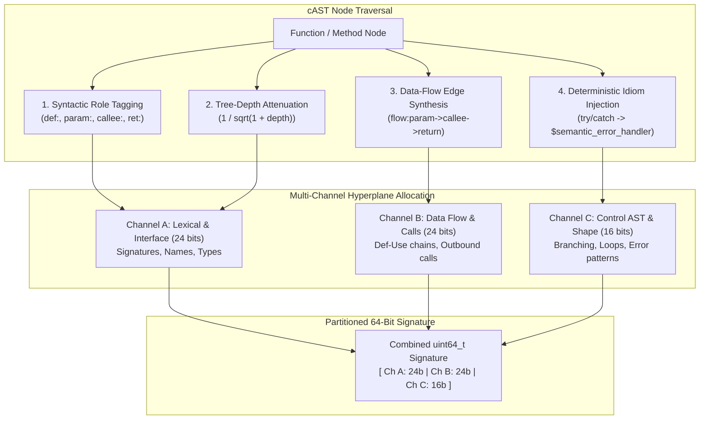

# RFC: cAST Structural Signal Boosting & Partitioned Multi-Channel Hyperplanes

**Status**: Proposed  
**Scope**: `groundcontrol-core`, `groundcontrol-common`  
**Date**: September 2026  
**Related Documents**: [[docs/concepts/search/binary-hamming-embedding]], [[docs/roadmap/RFC-algorithmic-semantic-bridging]], [[docs/architecture/implementation/cast-chunking]], [[docs/roadmap/coderoadmap]]

---

## 1. Executive Summary & Problem Statement

The [Binary Hamming Distance Embedding Architecture](file:///c:/dev/ctx/groundcontrol/docs/concepts/search/binary-hamming-embedding.md) delivers sub-millisecond search across hundreds of thousands of code symbols by eliminating neural model forward passes. However, collapsing rich source code into a 64-bit binary integer incurs three major semantic loss bottlenecks:

1. **2D $\rightarrow$ 1D Superposition Loss (Sequence & Role Collapse)**:
   Summing token vectors into a single 1D vector ($\sum \text{IDF}(t) \cdot \mathbf{v}_t$) commits the classic **Bag-of-Words fallacy**. It cannot distinguish between subject and object (`client.send(packet)` vs `packet.send(client)`), drops negation polarity (`if (auth)` vs `if (!auth)`), and cannot trace long-range variable dependencies.
2. **768-D Float $\rightarrow$ 64-Bit Binary Loss (Hyperplane Resolution & Blur)**:
   Compressing 24,576 bits of float coordinates ($768 \times 32$) into 64 bits (384:1 compression) creates angular blur. Subtly different functions with similar vocabulary collide on identical 64-bit signatures. Furthermore, 64 monolithic hyperplanes uniformly sample general vocabulary space while under-sampling specialized syntax and control structures.
3. **Out-of-Vocabulary (OOV) Drift**:
   Domain-specific composite identifiers (e.g., `processKubeletSyncBatch`) fall back to pseudo-random hash vectors, losing their natural semantic ties to `sync` or `batch`.

Because `groundcontrol` parses code via **cAST (Concrete Abstract Syntax Tree)** powered by Tree-sitter, we do not need to treat code like flat natural language prose. This RFC specifies **five cAST structural signal-boosting enhancements** that inject tree topology, execution flow, and partitioned hyperplanes directly into the binary embedding pipeline.

---

## 2. Theoretical Framework: The Five cAST Signal Boosters



---

### 2.1 Syntactic Role-Tagging (Role-Decorated Tokens)

Instead of passing raw identifier strings into the token accumulator, cAST decorates each token with its exact syntactic slot:

```text
Raw Tokens:   ["validate", "user", "token", "error"]

cAST Tagged:  ["def:validate", "param:user", "callee:token.verify", "ret:error"]
```

* **Mathematical Mechanism**: 
  In the static token embedding dictionary, tokens prefixed with role tags map to distinct semantic vectors. 
  - `def:validate` lives in the "functional intent" cluster.
  - `callee:validate` lives in the "dependency/consumer" cluster.
* **Impact**: Eliminates subject/object inversion. A query for *"functions that validate users"* matches a function where `user` is in `param:` and `validate` is in `def:`, rejecting a function where `user` is an internal temporary loop variable.

---

### 2.2 AST Tree-Depth & Salience Attenuation

In flat text chunking, every word has equal structural weight. In cAST, code has an explicit tree hierarchy. Deeply nested helper expressions and loop counters (`i`, `temp`, `buf`) create noise that dilutes the top-level semantic intent.

We define an **AST Depth Attenuation Factor**:

$$W_{\text{structural}}(t) = \text{IDF}(t) \times \frac{1}{\sqrt{1 + \text{AST\_Depth}(t)}}$$

```text
Depth 0: pub fn handle_payment(order: Order, auth: &Auth) -> Result<Receipt>  <-- Weight = 1.00
Depth 1:   if order.amount > 0 {                                              <-- Weight = 0.70
Depth 2:     for item in &order.items {                                       <-- Weight = 0.57
Depth 3:       let x = temp_buf[i];                                           <-- Weight = 0.50
```

* **Impact**: The top-level interface signature, parameters, and return types dominate the resulting 1D superposition vector $\mathbf{v}_{\text{chunk}}$. Nested implementation details are suppressed, preventing boilerplate from distorting high-level retrieval.

---

### 2.3 Data-Flow Edge Synthesis (Def-Use Chains)

cAST can track when a parameter flows directly into an outbound call or a return expression. Rather than hoping linear co-occurrence captures this relationship, cAST synthesizes **compound data-flow tokens**:

```typescript
function getUserData(userId: string): UserProfile {
    const raw = db.query(userId);
    return sanitize(raw);
}
```

cAST extracts the definition-use chain and synthesizes:
* `flow:param(userId)->call(db.query)`
* `flow:call(db.query)->call(sanitize)`
* `flow:call(sanitize)->return`

* **Impact**: Encodes functional behavior rather than naming. If another repository uses `fetchAccount(id)` with `flow:param(id)->call(db.query)->call(sanitize)->return`, both functions generate identical data-flow vector components, discovering behavioral clones across completely disjoint identifier vocabularies.

---

### 2.4 Partitioned Multi-Channel Hyperplanes

Rather than projecting the entire 1D vector against 64 monolithic, globally random hyperplanes, the 64 bits of the signature are explicitly allocated to **three orthogonal semantic channels**:

```
64-Bit Signature Word Layout:
┌─────────────────────────┬─────────────────────────┬────────────────────────┐
│ Channel A: Lexical/API  │ Channel B: Data Flow    │ Channel C: Control AST │
│ (Bits 0..23: 24 bits)   │ (Bits 24..47: 24 bits)  │ (Bits 48..63: 16 bits) │
├─────────────────────────┼─────────────────────────┼────────────────────────┤
│ Function names, types,  │ Def-use paths, callee   │ Branching, loop depth, │
│ parameters, docstrings  │ dependencies, returns   │ error handling shapes  │
└─────────────────────────┴─────────────────────────┴────────────────────────┘
```

#### Channel Specifications:
1. **Channel A (Lexical / Interface, 24 bits)**:
   Rotated vector derived exclusively from `def:`, `param:`, `ret:`, and docstring tokens.
2. **Channel B (Data Flow / Behavioral, 24 bits)**:
   Rotated vector derived from outbound `[:calls]` targets and synthesized `flow:*` chains.
3. **Channel C (Control Structure / Complexity, 16 bits)**:
   Rotated vector derived from the 25-float AST Structural Profile (counts of `if`, `for`, `while`, `match`, nesting depth, arithmetic vs. logic ops).

#### Targeted Querying & Masking:
Because channels occupy dedicated bit slices, the engine can execute **channel-masked Hamming sweeps**:
* **Behavioral Clone Search** (Ignore names, match implementation):
  $$\text{Mask}_{\text{behavioral}} = \text{0x0000\_FFFF\_FFFF\_0000} \quad (\text{Channels B \& C})$$
  $$\text{Dist} = \text{popcount}((\text{sig}_A \oplus \text{sig}_B) \ \& \ \text{Mask}_{\text{behavioral}})$$
* **Interface Compatibility Search** (Match types and parameters, ignore control flow):
  $$\text{Mask}_{\text{interface}} = \text{0x0000\_0000\_00FF\_FFFF} \quad (\text{Channel A})$$

---

### 2.5 Deterministic Idiom Injection

Syntactic conventions differ across programming languages, creating artificial semantic distance. cAST identifies canonical language patterns and injects standardized synthetic tokens into the token stream before superposition:

| cAST Pattern Detected | Languages | Synthetic Tokens Injected |
|---|---|---|
| `try { ... } catch (...)` / `rescue` | JS/TS, Java, Python, C++ | `$sem:error_handler`, `$sem:resilience` |
| `if (err != nil)` / `if err != nil` | Go, C | `$sem:error_handler`, `$sem:guard_clause` |
| `match result { Err(e) => ... }` | Rust | `$sem:error_handler`, `$sem:guard_clause` |
| `@Route(...)` / `app.get(...)` | TS, Python, Java | `$sem:http_endpoint`, `$sem:api_route` |
| `mutex.lock()` / `sync.Mutex` | Go, Rust, C++ | `$sem:concurrency_lock`, `$sem:thread_safety` |

* **Impact**: Connects cross-language idioms. An agent querying for *"error handling guard clauses"* retrieves matching functions in Go, Rust, and TypeScript with near-zero Hamming distance.

---

## 3. Implementation Plan & Rust API

### 3.1 Proposed Data Structures (`groundcontrol-core::semantic`)

```rust
/// Channel configuration for partitioned 64-bit signatures.
pub struct MultiChannelSignature {
    pub raw: u64,
}

impl MultiChannelSignature {
    pub const CHANNEL_LEXICAL_MASK: u64 = 0x0000_0000_00FF_FFFF; // Bits 0..23 (24 bits)
    pub const CHANNEL_DATAFLOW_MASK: u64 = 0x0000_FFFF_FF00_0000; // Bits 24..47 (24 bits)
    pub const CHANNEL_CONTROL_MASK:  u64 = 0xFFFF_0000_0000_0000; // Bits 48..63 (16 bits)

    #[inline]
    pub fn distance_channel(&self, other: &Self, channel_mask: u64) -> u32 {
        ((self.raw ^ other.raw) & channel_mask).count_ones()
    }

    #[inline]
    pub fn distance_total(&self, other: &Self) -> u32 {
        (self.raw ^ other.raw).count_ones()
    }
}
```

### 3.2 Phased Rollout

1. **Phase 1: cAST Role Tagging & Tree-Depth Attenuation**
   - Update [`crates/groundcontrol-core/src/parser/code/mod.rs`](file:///c:/dev/ctx/groundcontrol/crates/groundcontrol-core/src/parser/code/mod.rs) to emit `role:` prefixes during token extraction.
   - Implement $1/\sqrt{1 + \text{depth}}$ weighting in token accumulation.
2. **Phase 2: Deterministic Idiom Injection**
   - Extend grammar extractors for Rust, TypeScript, Go, and Python to inject `$sem:*` synthetic tokens on recognized AST patterns.
3. **Phase 3: Multi-Channel Partitioned Hyperplanes**
   - Implement 3-channel hyperplane projection (24b / 24b / 16b).
   - Add channel-specific bitwise masking to `VectorStore` candidate evaluation.
4. **Phase 4: Data-Flow Edge Synthesis**
   - Add basic intra-function def-use chain tracking to tree-sitter AST visitors.

---

## 4. Verification Plan

* **Automated Unit Tests**:
  - `test_subject_object_inversion`: Prove that `client.send(packet)` and `packet.send(client)` produce distinct 64-bit signatures with Hamming distance $> 12$.
  - `test_cross_language_idiom_alignment`: Prove that a Go `if err != nil` block and a Rust `if let Err(e) = res` block produce matching `$sem:error_handler` bits in Channel C.
  - `test_depth_attenuation`: Prove that renaming an inner loop variable `temp_i` does not alter the top 48 bits of the function's signature.
* **Retrieval Benchmarking**:
  - Evaluate on `RepoBench` and `CodeSearchNet`: Measure MRR@10 improvement against baseline un-tagged binary embeddings.
