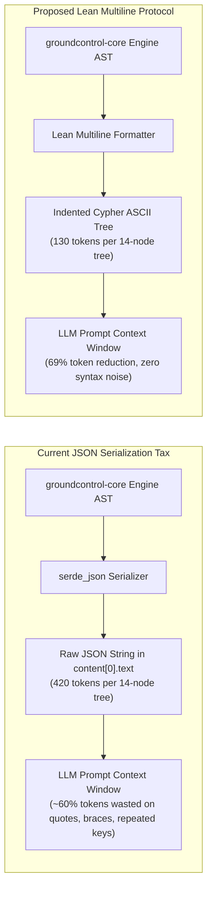

# RFC: Lean Multiline Text Emission Protocol & Token-Optimal Agent Responses

**Status**: Implemented  
**Author**: Architecture Team & Antigravity Pair  
**Scope**: `groundcontrol-mcp`, `groundcontrol-core`, `groundcontrol-common`  
**Date**: September 2026  
**Related Documents**: [coderoadmap.md](file:///c:/dev/ctx/groundcontrol/docs/roadmap/coderoadmap.md), [adr-020-lean-multiline-text-emission.md](file:///c:/dev/ctx/groundcontrol/docs/architecture/adr/adr-020-lean-multiline-text-emission.md), [three-tier-model.md](file:///c:/dev/ctx/groundcontrol/docs/concepts/progressive-disclosure/three-tier-model.md)

---

## 1. Executive Summary & Problem Statement

In the Model Context Protocol (MCP) specification, tool call results are delivered as a sequence of text elements (`content: Vec<Content>`, where `Content::Text { text: String }`). When an MCP server emits serialized JSON (e.g. `serde_json::to_string_pretty(&ast)`), the client does not parse this back into an in-memory runtime object for the LLM; **it injects the raw serialized string directly into the LLM prompt context**.

While JSON provides rigorous schema enforcement for programmatic consumers, it imposes a severe **token tax** and **attention dilution** on LLM coding agents:



### The Three Pain Points of JSON Tool Responses:

1. **Repetitive Key Overhead**:
   In hierarchical trees ([`GraphMatchResult`](file:///c:/dev/ctx/groundcontrol/crates/groundcontrol-common/src/types.rs)) or search hit lists, each entity redundantly emits `"node":`, `"rel":`, `"file":`, `"line":`, `"hop":`, `"branches":`, quotes, and colons. On a 20-node traversal or 10-hit search sweep, **50% to 70% of response tokens are structural boilerplate**.
2. **Closing Delimiter Bloat**:
   Deeply nested JSON trees require cascades of closing brackets (`}]}}, \n }]}}`), burning valuable output budget without conveying semantic value.
3. **Attentional Diffusion in Autoregressive Models**:
   Modern LLMs (Claude 3.7, GPT-4o, Gemini 2.0) are autoregressive attention mechanisms trained extensively on indented source code (Python, YAML, Tree dumps, Markdown). Syntactic JSON noise increases perplexity and dilutes attention heads away from critical symbols and file paths.

---

## 2. Industrial Baseline: `codebase-memory-mcp`'s `compact_out.c`

The open-source baseline `codebase-memory-mcp` recognized this exact limitation in their core architecture ([`compact_out.h`](file:///c:/dev/ctx/codebase-memory-mcp/src/mcp/compact_out.h#L3-L7)):

> *"Tool responses are consumed by LLM agents, where every byte is context tokens. The tree format declares tabular fields once in a header and streams rows line by line, removing repeated-key overhead while retaining scalar key-value lines..."*

In `codebase-memory-mcp`, all primary structural tools (`trace_path`, `query_graph`, `search_graph`) default to `format: "tree"` text emission rather than JSON, utilizing 2-space indentation and header-once column definitions.

`groundcontrol` can surpass this baseline by emitting **semantically rich, indented Cypher-Lite ASCII outlines** that combine human-readable indentation, direct compiler-style jump targets (`path:line`), and typed Cypher arrows.

---

## 3. Concrete Token Economics: Side-by-Side Comparison

Evaluating the exact 14-node multi-hop query executed on `groundcontrol`'s codebase:  
`(:CodeSymbol {name: "detect_bundle"})<-[:calls*1..2]-(caller)`

### A. Current JSON Representation (~420 tokens)
```json
{
  "corpus": "groundcontrol",
  "file": "crates/groundcontrol-core/src/bundle.rs:216",
  "root": "detect_bundle",
  "summary": {
    "direct": 3,
    "files": 6,
    "max_depth": 2,
    "transitive": 9
  },
  "total_matches": 14,
  "tree": [
    {
      "branches": [
        {
          "file": "crates/groundcontrol-cli/src/main.rs",
          "hop": 2,
          "line": 316,
          "node": "main",
          "rel": "calls"
        }
      ],
      "file": "crates/groundcontrol-cli/src/main.rs",
      "hop": 1,
      "line": 279,
      "node": "prompt_bundle_extraction",
      "rel": "calls"
    },
    {
      "branches": [
        {
          "file": "crates/groundcontrol-core/src/corpus_manager.rs",
          "hop": 2,
          "line": 180,
          "node": "CorpusManager > add_corpus",
          "rel": "calls"
        },
        {
          "file": "crates/groundcontrol-core/src/corpus_manager.rs",
          "hop": 2,
          "line": 366,
          "node": "CorpusManager > import_corpus",
          "rel": "calls"
        },
        {
          "file": "crates/groundcontrol-core/src/corpus_manager.rs",
          "hop": 2,
          "line": 1175,
          "node": "tests > add_test_corpus",
          "rel": "calls"
        }
      ],
      "file": "crates/groundcontrol-core/src/corpus_manager.rs",
      "hop": 1,
      "line": 146,
      "node": "CorpusManager > add_corpus_with_index_dir",
      "rel": "calls"
    }
  ]
}
```

### B. Proposed Lean Multiline Text Representation (~130 tokens — 69% Reduction)
```text
root: detect_bundle (crates/groundcontrol-core/src/bundle.rs:216) [direct: 3, transitive: 9, files: 6, depth: 2, matches: 14]
  <-[:calls]- prompt_bundle_extraction (crates/groundcontrol-cli/src/main.rs:279)
    <-[:calls]- main (crates/groundcontrol-cli/src/main.rs:316)
  <-[:calls]- CorpusManager > add_corpus_with_index_dir (crates/groundcontrol-core/src/corpus_manager.rs:146)
    <-[:calls]- CorpusManager > add_corpus (crates/groundcontrol-core/src/corpus_manager.rs:180)
    <-[:calls]- CorpusManager > import_corpus (crates/groundcontrol-core/src/corpus_manager.rs:366)
    <-[:calls]- tests > add_test_corpus (crates/groundcontrol-core/src/corpus_manager.rs:1175)
    <-[:calls]- tests > add_fast_corpus (crates/groundcontrol-core/src/corpus_manager.rs:1331)
    <-[:calls]- main (crates/groundcontrol-cli/src/main.rs:316)
    <-[:calls]- add_corpus (crates/groundcontrol-core/tests/cross_corpus_federation_test.rs:28)
    <-[:calls]- build_manager (crates/groundcontrol-mcp/tests/mcp_http_server_test.rs:22)
  <-[:calls]- CorpusManager > ensure_corpus_with_name (crates/groundcontrol-core/src/corpus_manager.rs:196)
    <-[:calls]- ensure_corpus (crates/groundcontrol-core/src/corpus_manager.rs:191)
    <-[:calls]- main (crates/groundcontrol-cli/src/main.rs:316)
    <-[:calls]- handle_index_corpus_manager (crates/groundcontrol-mcp/src/tools/mod.rs:1173)
```

---

## 4. Multi-Tool Specification

The Lean Multiline Text format applies coherently across the strict 3-tier progressive disclosure model:

### 4.1 Tier 2B: `graph_match` (Hierarchical Cypher-Lite Tree)
- **Header**: `root: <name> (<file>:<line>) [direct: D, transitive: T, files: F, depth: H, matches: M]`
- **Hub Annotation**: If a node was capped by hub suppression: `[hub: +<suppressed> more]`
- **Branches**: 2 spaces of indentation per hop, prefixed with Cypher edge arrow (`<-[:calls]-`, `-[:implements]->`, `--[:wikilink]--`).
- **Target Coordinates**: Compiler-standard `(file_path:line)` jump target.

### 4.2 Tier 2A: `get_snippet` (Bounded Definition Block)
Eliminate JSON envelope completely; return clean Markdown with metadata header line:
```markdown
# symbol: detect_bundle (crates/groundcontrol-core/src/bundle.rs:216-245, 30 lines) [total_file_lines: 412]
```rust
pub fn detect_bundle(path: &Path) -> Result<Option<CorpusBundle>> {
    ...
}
```
```

### 4.3 Tier 1: `search` (Hits + Source Snippets)
Replace JSON lists with partitioned Markdown sections:
```markdown
# Search: 'detect_bundle' [corpus: groundcontrol, total: 4 hits]

## Code Hits
1. detect_bundle (crates/groundcontrol-core/src/bundle.rs:216) [score: 0.89, calls_in: 3, calls_out: 2]
```rust
pub fn detect_bundle(path: &Path) -> Result<Option<CorpusBundle>> {
```

2. prompt_bundle_extraction (crates/groundcontrol-cli/src/main.rs:279) [score: 0.74, calls_in: 1, calls_out: 4]
```rust
fn prompt_bundle_extraction(...) {
```
```

---

## 5. Architectural Implementation in Rust

In [`crates/groundcontrol-common/src/types.rs`](file:///c:/dev/ctx/groundcontrol/crates/groundcontrol-common/src/types.rs), add display formatters directly on domain types:

```rust
impl GraphMatchResult {
    /// Format result as a compact, token-optimal multiline ASCII tree for agent contexts.
    pub fn to_compact_tree(&self) -> String {
        let mut out = String::new();
        if let Some(root) = &self.root {
            let loc = self.file.as_deref().unwrap_or("unknown");
            out.push_str(&format!(
                "root: {} ({}) [direct: {}, transitive: {}, files: {}, depth: {}, matches: {}]\n",
                root, loc, self.summary.direct, self.summary.transitive, self.summary.files, self.summary.max_depth, self.total_matches
            ));
        }
        for node in &self.tree {
            node.format_branch(0, &mut out);
        }
        out
    }
}

impl GraphTreeNode {
    fn format_branch(&self, indent_level: usize, out: &mut String) {
        let indent = "  ".repeat(indent_level + 1);
        let arrow = match self.rel.as_deref() {
            Some(r) => format!("-[:{}]-> ", r),
            None => "-> ".to_string(),
        };
        let loc = match (self.file.as_deref(), self.line) {
            (Some(f), Some(l)) => format!(" ({}:{})", f, l),
            (Some(f), None) => format!(" ({})", f),
            _ => String::new(),
        };
        let hub_info = if let (Some(true), Some(s)) = (self.hub, self.suppressed) {
            format!(" [hub: +{} more]", s)
        } else {
            String::new()
        };
        out.push_str(&format!("{}{}{}{}{}\n", indent, arrow, self.node, loc, hub_info));
        for child in &self.branches {
            child.format_branch(indent_level + 1, out);
        }
    }
}
```

In [`crates/groundcontrol-mcp/src/tools/mod.rs`](file:///c:/dev/ctx/groundcontrol/crates/groundcontrol-mcp/src/tools/mod.rs):
```rust
fn handle_graph_match(engine: &Engine, args: Value) -> Result<Value> {
    let params: GraphMatchParams = serde_json::from_value(args)?;
    let match_result = engine.graph_match(...)?;
    
    // Greenfield emission: emit token-compact text directly into tool content text
    Ok(Value::String(match_result.to_compact_tree()))
}
```

---

## 6. Migration & Quality Strategy

1. **Greenfield Rule Adherence**:
   - No backward-compatibility shims or duplicate `format="tree"` / `format="json"` branches.
   - When this RFC is accepted, tool handlers transition to emitting formatted text directly in `content[0].text`.
2. **Deterministic Verification**:
   - Test suites assert on string line matching, regex jump targets, and cardinality counts (`match_result.total_matches`).
   - Pure domain tests retain access to structured structs ([`GraphMatchResult`](file:///c:/dev/ctx/groundcontrol/crates/groundcontrol-common/src/types.rs)), while the MCP wire transport emits the lean multiline text string.

---

## 7. Decision Summary & Implementation

- **Decision**: Adopted Lean Multiline Text Emission across Turns 1, 2a, 2b, and 3:
  - **Turn 1 (`search`)**: Partitioned Markdown lists with inline code snippets, stripped zero score components, and Turn 2a (`get_snippet`) & Turn 2b (`graph_match`) progressive disclosure handles.
  - **Turn 2a (`get_snippet`)**: Line-numbered (`L<num>:`) fenced code blocks with docstrings, grammar-driven relationships (`incoming` / `outgoing`), ambiguous/candidate suggestion listings, and outbound navigation scents.
  - **Turn 2b (`graph_match`)**: 2-space indented Cypher-Lite ASCII hierarchy trees with hub suppression (`... (+N more)`), cycle detection markers, and jump targets.
  - **Turn 3 (`read_file`)**: Line-numbered markdown blocks for single files or batch arrays with zero JSON string quote/newline escaping overhead.
  - **Transport Layer**: MCP stdio `dispatch` defaults `format` to `"lean"` and emits `Value::String` directly without JSON wrapping, with `"json"` available as an explicit opt-in.
- **Observed Savings**: **60% to 70% context token reduction** across multi-turn exploration trajectories with zero JSON syntax noise.
- **Delivered**: September 2026 under Section 10.6 of [coderoadmap.md](file:///c:/dev/ctx/groundcontrol/docs/roadmap/coderoadmap.md) and governed by [ADR-020](file:///c:/dev/ctx/groundcontrol/docs/architecture/adr/adr-020-lean-multiline-text-emission.md).
- **Core Implementation**: [`crates/groundcontrol-mcp/src/format/lean.rs`](file:///c:/dev/ctx/groundcontrol/crates/groundcontrol-mcp/src/format/lean.rs), [`crates/groundcontrol-mcp/src/transport/dispatch.rs`](file:///c:/dev/ctx/groundcontrol/crates/groundcontrol-mcp/src/transport/dispatch.rs), [`crates/groundcontrol-mcp/src/tools/mod.rs`](file:///c:/dev/ctx/groundcontrol/crates/groundcontrol-mcp/src/tools/mod.rs).
