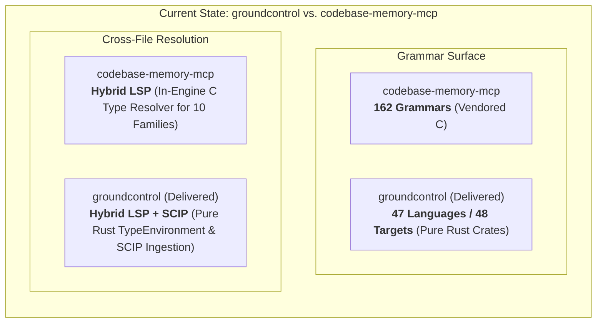
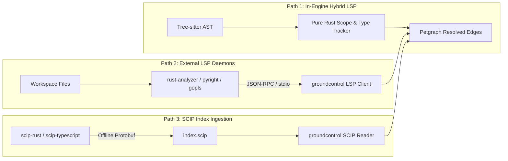

# RFC: Polyglot Tree-sitter Grammar Expansion & LSP Integration Analysis

**Status**: Implemented (Tier 1 Delivered; Tier 2 & Tier 3 on Roadmap)  
**Author**: Antigravity & Architecture Team  
**Scope**: `groundcontrol-core`, `groundcontrol-common`, `groundcontrol-mcp`  
**Date**: September 2026  
**Target Version**: `0.1.0`+  
**Related Documents**: [CODEROADMAP.md](file:///c:/dev/semantic/groundcontrol/docs/CODEROADMAP.md), [optimisation.md](file:///c:/dev/semantic/groundcontrol/docs/optimisation.md), [RFC-adaptive-graph-expansion.md](file:///c:/dev/semantic/groundcontrol/docs/RFC-adaptive-graph-expansion.md), [how-cast-chunking-works.md](file:///c:/dev/semantic/groundcontrol/docs/how-cast-chunking-works.md)

---

## 1. Executive Summary & Problem Statement

`groundcontrol` (`gc`) is an enterprise semantic Model Context Protocol (MCP) server designed to deliver sub-millisecond, high-signal retrieval for AI coding agents without file dumping or non-deterministic LLM entity extraction. Central to this mission is **cAST (Syntactic Abstract Syntax Tree) chunking** and **deterministic code graph construction** (`defines`, `imports`, `calls`, `implements_trait`), executed in 100% safe, pure Rust (`#![forbid(unsafe_code)]`).



### The Two Core Questions Addressed:
1. **Grammar Parity**: What Tree-sitter parsers are missing compared to `codebase-memory-mcp` (which vendors 162 grammars)? Which open-source Rust Tree-sitter crates or vendoring strategies should `groundcontrol` adopt?
2. **LSP Integration**: What does "adding our own LSPs" mean in practice? How difficult is it to build an in-engine static semantic type resolver ("Hybrid LSP") versus hosting live Language Server Protocol daemons (`rust-analyzer`, `pyright`, `gopls`) or ingesting SCIP index archives?

---

## 2. Invariant Constraints for `groundcontrol`

Any implementation proposal must conform to `groundcontrol`'s core architectural invariants defined in [`GEMINI.md`](file:///c:/dev/semantic/groundcontrol/GEMINI.md):

1. **Source on disk is authoritative ground truth**: Indices (SQLite, Tantivy BM25, HNSW, Petgraph) are disposable and 100% rebuildable.
2. **Sub-millisecond latency**: Query dispatch and graph traversal must remain sub-millisecond (lexical p50 ~2.2ms, graph BFS ~1.8ms). Cold indexing must not stall agent turns.
3. **Pure Rust safety**: Maintained with `#![forbid(unsafe_code)]` at the workspace boundary. No mandatory runtime C compiler toolchains or external database daemons.
4. **Zero external agent dependencies**: An MCP server must be zero-friction: installing `groundcontrol` cannot require the user to have global installations of Node.js, `rust-analyzer`, Python 3.12, or `clangd` just to index a repository.

---

## 3. Comparative Grammar Audit: `codebase-memory-mcp` vs. `groundcontrol`

### 3.1 Quantitative Delta
- **`codebase-memory-mcp`**: **162 vendored grammars** (143 verified upstream, 14 first-party/forked, 5 registry-resolved, recorded in [`internal/cbm/vendored/grammars/MANIFEST.md`](file:///c:/dev/semantic/codebase-memory-mcp/internal/cbm/vendored/grammars/MANIFEST.md)).
- **`groundcontrol`**: **16 language targets / 15 distinct languages** ([`crates/groundcontrol-core/src/parser/code/languages.rs`](file:///c:/dev/semantic/groundcontrol/crates/groundcontrol-core/src/parser/code/languages.rs)):
  - Rust, TypeScript, TSX, JavaScript, Python, Go, C, C++, Java, C#, Ruby, PHP, Swift, Elixir, Lua, Bash.
- **Delta**: **147 missing grammars**.

### 3.2 Categorized Taxonomy of Missing Grammars

| Tier | Category | Key Missing Grammars | Enterprise Impact & Relevance |
| :---: | :--- | :--- | :--- |
| **1** | **Modern Compiled & Functional** | `kotlin`, `scala`, `zig`, `dart`, `haskell`, `ocaml`, `fsharp`, `clojure`, `erlang`, `gleam`, `julia`, `solidity`, `r`, `objc` | **Critical**. Android microservices (Kotlin), data infrastructure (Scala/Spark/Kafka), systems tooling (Zig), mobile (Dart/Flutter), and smart contracts (Solidity). |
| **2** | **Web & UI Frameworks** | `html`, `css`, `scss`, `vue`, `svelte`, `astro`, `jinja2`, `blade`, `liquid` | **High**. Fullstack monorepos containing frontend components, templates, and styling alongside backend services. |
| **3** | **Query, Schema & DevOps** | `sql`, `graphql`, `yaml`, `json`, `json5`, `toml`, `dockerfile`, `hcl`, `nix`, `cmake`, `make`, `protobuf` | **High**. Microservice definitions, Terraform infrastructure-as-code, Docker recipes, Kubernetes manifests, and gRPC contracts. |
| **4** | **Shaders & Hardware** | `wgsl`, `glsl`, `hlsl`, `cuda`, `verilog`, `systemverilog`, `vhdl` | **Moderate**. Graphics pipelines, WebGPU compute, LLM acceleration kernels, FPGA synthesis. |
| **5** | **Legacy, Math & Domain-Specific** | `fortran`, `cobol`, `matlab`, `pascal`, `ada`, `move`, `cairo`, `sway`, `chialisp`, `wolfram`, `perl` | **Niche**. High-performance computing, fintech mainframes, specialized blockchain DSLs. |

---

## 4. Grammar Implementation Strategies for `groundcontrol`

### 4.1 The Current Architectural Bottleneck in `groundcontrol`
In `groundcontrol-core`, language parsing is currently hardcoded procedurally in [`chunker.rs`](file:///c:/dev/semantic/groundcontrol/crates/groundcontrol-core/src/parser/code/chunker.rs) across nearly 1,400 lines:
```rust
// Current procedural approach in chunker.rs:
fn traverse(&mut self, node: Node) {
    let symbol_info = match self.language {
        SupportedLanguage::Rust => self.classify_rust_node(node),
        SupportedLanguage::Python => self.classify_python_node(node),
        // ... 12 more procedural functions
    };
}
```
Adding 30–50 languages with procedural classification functions would balloon `chunker.rs` to over 5,000 lines of brittle, duplicated AST node walkers.

### 4.2 Architectural Solution: Declarative `LanguageSpec` Table
`codebase-memory-mcp` solved this cleanly in [`internal/cbm/lang_specs.c`](file:///c:/dev/semantic/codebase-memory-mcp/internal/cbm/lang_specs.c). We can adopt this pattern in pure Rust:

```rust
/// Declarative specification for syntactic code extraction.
pub struct LanguageSpec {
    pub language: SupportedLanguage,
    pub function_node_kinds: &'static [&'static str],
    pub type_node_kinds: &'static [&'static str],
    pub interface_node_kinds: &'static [&'static str],
    pub name_field: &'static str,
    pub comment_prefix: &'static str,
    pub doc_comment_kinds: &'static [&'static str],
}
```

A single generic `AstExtractor` traverses AST nodes and checks `spec.function_node_kinds.contains(&node.kind())`. Only ~10% of languages with eccentric grammar structures (e.g. Lisp macros, Haskell value bindings, C-family declarator wrappers) require custom extractors.

### 4.3 Strategy Evaluation: Crates vs. Vendored Grammars

| Dimension | Strategy A: crates.io Dependencies | Strategy B: Vendored C Grammars (`cc` in `build.rs`) |
| :--- | :--- | :--- |
| **Description** | Add individual crates (e.g. `tree-sitter-kotlin = "0.23"`) to `Cargo.toml`. | Vendor `parser.c` and `scanner.c` into `vendored/grammars/`, build with `cc::Build`. |
| **Grammar Count** | 20–30 high-demand languages. | Up to all 162 grammars (exact parity with `codebase-memory-mcp`). |
| **Rust Safety** | Safe wrapper around C runtime. Matches `#![forbid(unsafe_code)]`. | Requires `extern "C"` FFI declaration; wrapped in safe `Language` type. |
| **Maintenance** | Cargo handles downloads, builds, and updates. | Requires auditing licenses, ABI compatibility (ABI 13–15), and C compiler. |
| **Build Time** | High crate count increases Cargo compilation and link times. | Fast parallel C compilation via `cc` crate. |
| **Recommendation** | **Adopt for Phase 1 (Top 25 languages)**. | **Adopt for Phase 2 if full 162-language breadth is required**. |

---

## 5. LSP Integration Analysis: Three Architectural Paths

When considering "adding our own LSPs", three distinct architectural models exist with starkly different complexity, latency, and operational profiles.



### 5.1 Path 1: In-Engine "Hybrid LSP" (Lightweight Static Type & Scope Resolver)

#### What It Is
An embedded, pure-Rust static analysis pass that operates directly on Tree-sitter ASTs and SQLite symbol tables without launching any external processes. This is the exact mechanism used by `codebase-memory-mcp` (in [`internal/cbm/lsp/`](file:///c:/dev/semantic/codebase-memory-mcp/internal/cbm/lsp/)).

#### How It Works in `groundcontrol`
Currently, [`crates/groundcontrol-core/src/graph/code.rs`](file:///c:/dev/semantic/groundcontrol/crates/groundcontrol-core/src/graph/code.rs) resolves calls via basic lexical heuristics:
1. Match in current file symbols.
2. Match unique symbol in workspace.
3. Fall back to same-directory candidate with `ResolutionConfidence::Medium` or `Speculative`.

An in-engine "Hybrid LSP" upgrades this by maintaining a **Lexical Scope Stack** and **Type Binding Table**:
1. **Local Variable Type Tracking**:
   - `let client = SearchClient::new();` $\to$ Record `client: SearchClient` in local lexical scope.
   - `const user: UserProfile = ...;` $\to$ Record `user: UserProfile`.
2. **Receiver Method Resolution**:
   - Encountering `client.query(...)`: Rather than searching for any global `query` function, resolve `SearchClient::query`.
3. **Explicit Import Resolution**:
   - Resolves `use crate::search::hybrid::HybridEngine;` or `import { Engine } from './engine'` to specific file paths before matching symbols.
4. **Interface / Trait Hierarchy**:
   - Traverses `implements_trait` edges in Petgraph to resolve dynamic dispatches.

#### Feasibility & Cost
- **Difficulty**: **Medium** (1 to 2 weeks for top languages: Rust, TypeScript, Python, Go).
- **Latency Impact**: Zero perceptible overhead (adds ~0.2ms per file during parsing).
- **Dependencies**: Zero external dependencies, pure Rust.

---

### 5.2 Path 2: Real LSP Client (Daemon Orchestration)

#### What It Is
Launching and managing actual Language Server Protocol daemons (`rust-analyzer`, `typescript-language-server` / `vtsls`, `pyright`, `gopls`, `clangd`) as child processes communicating over JSON-RPC via stdio.

#### What Needs to Be Built
1. **Daemon Lifecycle & Process Supervisor**:
   - Process launcher using `tokio::process::Command`.
   - Health checking, timeout guards, graceful termination, crash recovery.
2. **JSON-RPC State Machine**:
   - Protocol negotiation via `lsp-types` crate.
   - Handshake sequence: `initialize` $\to$ `initialized` $\to$ `textDocument/didOpen`.
   - Asynchronous request-response correlation (`id` matching).
3. **Query Engine**:
   - Querying `textDocument/definition` for every identifier token.
   - Querying `textDocument/prepareCallHierarchy` + `callHierarchy/incomingCalls` / `outgoingCalls`.
   - Querying `textDocument/references`.
4. **Graph Synchronization**:
   - Converting LSP `Location`, `Range`, and `CallHierarchyItem` objects into `groundcontrol`'s `Edge` and `CodeSymbol` models.

#### Fatal Operational Drawbacks for an MCP Context Server
1. **Cold-Start Latency Breakdown**:
   - `rust-analyzer` takes **15 to 90 seconds** to scan `Cargo.lock`, compile procedural macros, and warm its Salsa database on medium repositories.
   - `groundcontrol`'s primary design goal is **immediate readiness**. Forcing an AI agent to wait 60 seconds on turn 1 degrades UX drastically.
2. **Memory Footprint**:
   - Running `rust-analyzer` + `pyright` + `gopls` concurrently consumes **2 to 6 GB of RAM**. `groundcontrol` currently operates within ~100–300 MB.
3. **Host Environment Fragility**:
   - If the user machine lacks `pyright` or `gopls` in `$PATH`, or has mismatched compiler versions, the server fails silently or crashes.
   - Unsaved or partially typed files in IDE workflows frequently cause LSP daemons to produce error states or freeze.

---

### 5.3 Path 3: SCIP (Source Code Intelligence Protocol) Index Ingestion

#### What It Is
SCIP (developed by Sourcegraph) is a language-agnostic, protobuf-based schema for indexing code navigation data (definitions, references, hover documentation, symbols) generated by compiler-backed indexing CLI tools (`scip-rust`, `scip-typescript`, `scip-python`, `scip-go`, `scip-clang`).

#### How It Works
Instead of running heavy daemons dynamically:
1. An offline tool (or CI pipeline, or optional user CLI command `groundcontrol index --scip index.scip`) generates an `index.scip` protobuf file.
2. `groundcontrol` reads the protobuf file using `prost` or `quick-protobuf`.
3. Directly loads 100% compiler-accurate `defines`, `calls`, and `references` edges into SQLite and Petgraph in **<100ms**.

#### Feasibility & Cost
- **Difficulty**: **Low to Medium** (3 to 5 days).
- **Latency Impact**: Sub-second ingestion; zero runtime query overhead.
- **Precision**: 100% compiler-accurate (exact macro expansions, types, cross-package resolution).

---

## 6. Comprehensive Architectural Trade-Off Matrix

| Evaluation Dimension | Status Quo (`groundcontrol`) | Option 1: In-Engine Hybrid LSP | Option 2: Live LSP Daemons | Option 3: SCIP Ingestion |
| :--- | :---: | :---: | :---: | :---: |
| **Resolution Precision** | Medium (heuristic fallback) | High (type & scope aware) | Exact (100% compiler truth) | Exact (100% compiler truth) |
| **Index Speed** | **Fastest** (<1s) | **Fast** (<1.2s) | **Slowest** (15s–90s+ cold start) | **Fastest** (<200ms ingestion) |
| **Query Latency (p50)** | **<2ms** | **<2ms** | 10ms–50ms (IPC roundtrip) | **<2ms** |
| **Memory Footprint** | **~150 MB** | **~160 MB** | **2 GB – 6 GB** | **~180 MB** |
| **Host Toolchain Dependencies** | **None** | **None** | Requires all language LSPs in PATH | Requires offline SCIP generator |
| **Engineering Complexity** | Minimal | Moderate (2–3 weeks) | High / Brittle (5–8 weeks) | Low / Clean (1–2 weeks) |
| **Pure Rust Compatibility** | 100% | 100% | Degraded (external processes) | 100% |

---

---

## 7. Phased Architecture & Strategic Roadmap (Tiers 1, 2, 3)

```mermaid
timeline
    title Strategic Implementation Roadmap
    section Tier 1 : Pure Rust Crates & In-Engine LSP (Delivered)
        Declarative LanguageSpec : spec/ modular declarative symbol mapping
        47 Language Support : 47 languages across official tree-sitter crates
        Pure-Rust Hybrid LSP : TypeEnvironment & receiver method resolution
        SCIP Ingestion : Direct protobuf ingestion via Engine::ingest_scip
    section Tier 2 : Vendored C Grammars (Roadmap)
        Upstream C Vendoring : parser.c / scanner.c via cc::Build in build.rs
        Long-Tail Coverage : Clojure, Nim, Odin, Fortran, COBOL, Ada, Apex, Perl
    section Tier 3 : Compiler-Grade Tooling (Roadmap)
        SCIP CI Tooling : Automated pre-indexing wrappers for toolchains
        External LSP Socket : Opt-in socket client to existing IDE LSP daemons
```

### 7.1 Tier 1: Declarative Specs, 47 Languages, Hybrid LSP & SCIP (Delivered)
1. **Declarative `LanguageSpec` Architecture**:
   Unified declarative specifications modularized across language families in [`crates/groundcontrol-core/src/parser/code/spec/`](file:///c:/dev/semantic/groundcontrol/crates/groundcontrol-core/src/parser/code/spec/mod.rs) covering 47 programming and config languages.
2. **Grammar Expansion**:
   Expanded from 15 to **47 supported languages** across systems, web, scripting, functional, cloud/infra, and schema domains.
3. **In-Engine Pure-Rust Hybrid LSP**:
   Implemented `TypeEnvironment` and lexical scopes in [`crates/groundcontrol-core/src/graph/code.rs`](file:///c:/dev/ctx/groundcontrol/crates/groundcontrol-core/src/graph/code.rs), enabling receiver method disambiguation (`x.method()` $\to$ `Type::method`) with `ResolutionConfidence::High`.
4. **SCIP Protobuf Index Ingestion**:
   Added [`crates/groundcontrol-core/src/graph/scip.rs`](file:///c:/dev/ctx/groundcontrol/crates/groundcontrol-core/src/graph/scip.rs) and `Engine::ingest_scip` with CLI `--scip <PATH>`, supporting <200ms ingestion of compiler-exact `.scip` dumps.

### 7.2 Tier 2: Upstream C/C++ Tree-Sitter Grammars via `cc` in `build.rs` (Roadmap)
* **Goal**: Expand from 47 to 100+ languages by directly compiling upstream C grammars (`parser.c`, `scanner.c`) via `cc::Build` in `build.rs`.
* **Target Languages**: Clojure, Nim, Odin, Fortran, COBOL, Ada, Apex, Pascal, Perl, Erlang, Fish, V, Reason, Scheme, Common Lisp, Racket.
* **Safety Isolation**: Maintain `#![forbid(unsafe_code)]` at our crate boundary by isolating raw FFI declarations within a sealed `ffi` module.

### 7.3 Tier 3: Compiler-Grade Code Intelligence & LSP Daemon Integrations (Roadmap)
* **Automated SCIP Pipeline**: Toolchain automation hooks for `scip-rust`, `scip-typescript`, `scip-python`, and `scip-clang` with incremental diffing and cross-corpus namespace resolution.
* **External LSP Socket Connector**: Zero-overhead opt-in socket client (`--lsp-socket <lang>:<addr>`) connecting to pre-existing background IDE language servers without spawning unmanaged, memory-heavy daemon supervisor processes inside `groundcontrol`.
