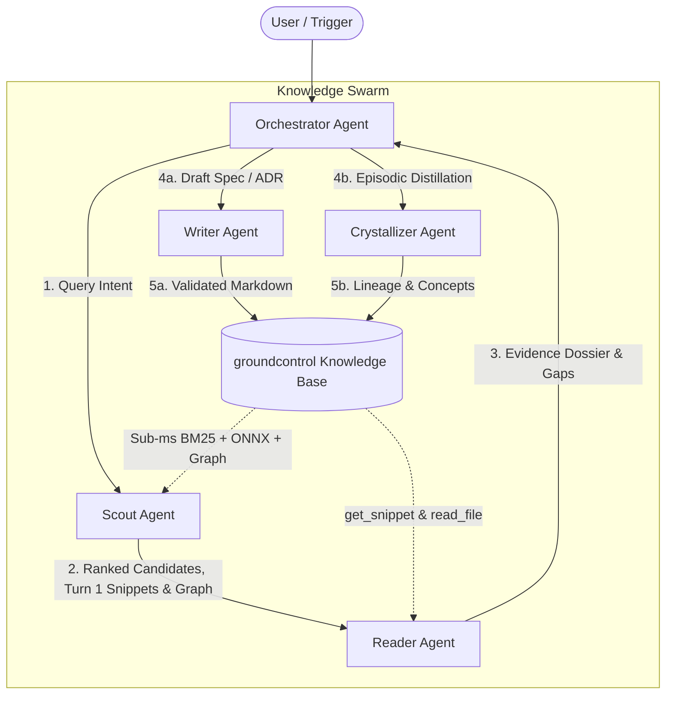

# Multi-Agent Swarm Orchestration with groundcontrol

This guide provides blueprint architectures for orchestrating multi-agent swarms powered by `groundcontrol` as a sub-millisecond, shared semantic memory substrate (17 authoritative tools).



---

## 1. Pipeline Blueprints

### Pipeline A: Autonomous Technical Research Swarm
*Goal: Answer deep multi-faceted engineering questions with rigorous citations and verified facts.*

1. **Orchestrator** receives user query (e.g. *"How do we handle SQLite lock contention during parallel vector compaction?"*).
2. **Scout Agent** executes `search(query="...", mode="hybrid", snippets=3)` and inspects Turn 1 snippets and graph affordances. If call paths or multi-entity links are needed, calls `graph_match(pattern="...")`. Returns top candidate paths, snippets, and relations.
3. **Reader Agent** inspects candidate definitions using `get_snippet(symbol="...")` or line-bounded `read_file(path="...", start_line=..., end_line=...)`. Validates that documents are currently `accepted` (not `superseded`), traces any superseding ADRs with `graph_match`, and compiles an Evidence Dossier.
4. **Orchestrator** delivers a comprehensive, cited response to the user.

---

### Pipeline B: Incident-to-ADR Knowledge Crystallization Swarm
*Goal: Convert raw incident debugging traces into permanent Architecture Decision Records with full provenance.*

1. **Incident Trigger**: Agent finishes resolving an outage or complex bug recorded in a scratchpad/incident log.
2. **Crystallizer Agent** inspects the conversation log and calls `write_note(mode="create")` targeting `concepts/` or `decisions/`, embedding `derived_from: "incidents/inc-001.md"` in frontmatter.
3. **Writer Agent** fills in required ADR sections (`Context`, `Decision`, `Consequences`), formats frontmatter according to `decision_record` template, and calls `validate(path="...")`.
4. **Crystallizer Agent** runs `graph_match(pattern="(:DocNode {path: '...'})-[:derived_from*1..]->(source)")` to ensure the new ADR links back to the original incident note.

---

### Pipeline C: Continuous Vault Hygiene & Refactoring Swarm
*Goal: Maintain clean taxonomy, fix broken links, and optimize graph topology.*

1. **Ops / Scout Agent** executes `validate` (full corpus audit), `status(scope="coverage")`, and `graph_communities(view="architecture")`.
2. **Writer Agent** updates or refactors notes using `write_note`, `move_note`, and immediately runs `validate(path="...")` and `validate(check_taxonomy=true)`.
3. **Ops Agent** calls `sync_corpus(mode="delta")` to update the active search index.

---

## 2. Handoff Message Contracts

### Scout to Reader Handoff Contract
```json
{
  "handoff_type": "SCOUT_TO_READER",
  "query": "SQLite lock contention during compaction",
  "candidates": [
    {
      "path": "decisions/adr-001-graph-engine.md",
      "score": 0.045,
      "turn1_snippet": "SQLite WAL mode with busy_timeout configured for 5000ms.",
      "affordances": { "calls_out": 2, "wikilinks_in": 3 }
    },
    {
      "path": "concepts/vector-index.md",
      "score": 0.038,
      "turn1_snippet": "Compaction runs in background thread acquiring temporary write transaction.",
      "affordances": { "wikilinks_in": 5 }
    }
  ],
  "graph_connections": [
    "(:DocNode {path: 'decisions/adr-001-graph-engine.md'})-[:implements]->(:DocNode {path: 'concepts/vector-index.md'})"
  ]
}
```

### Reader to Writer Handoff Contract
```json
{
  "handoff_type": "READER_TO_WRITER",
  "task": "DRAFT_ADR",
  "template": "decision_record",
  "target_path": "decisions/adr-004-wal-compaction-locks.md",
  "frontmatter": {
    "title": "ADR 004: Dedicated WAL Connection Pool for Vector Compaction",
    "status": "proposed",
    "date": "2026-08-30",
    "template": "decision_record",
    "tags": ["sqlite", "concurrency", "vector"]
  },
  "content": "---\ntitle: \"ADR 004: Dedicated WAL Connection Pool for Vector Compaction\"\nstatus: proposed\ndate: 2026-08-30\ntemplate: decision_record\ntags:\n  - sqlite\n  - concurrency\n  - vector\n---\n\n# ADR 004: Dedicated WAL Connection Pool\n\n## Context\nVector compaction holding SQLite write locks causes stdio RPC latency spikes.\n\n## Decision\nIsolate vector metadata to a secondary SQLite connection with WAL PRAGMAs.\n\n## Consequences\nZero reader thread blocking, slight increase in memory footprint."
}
```
